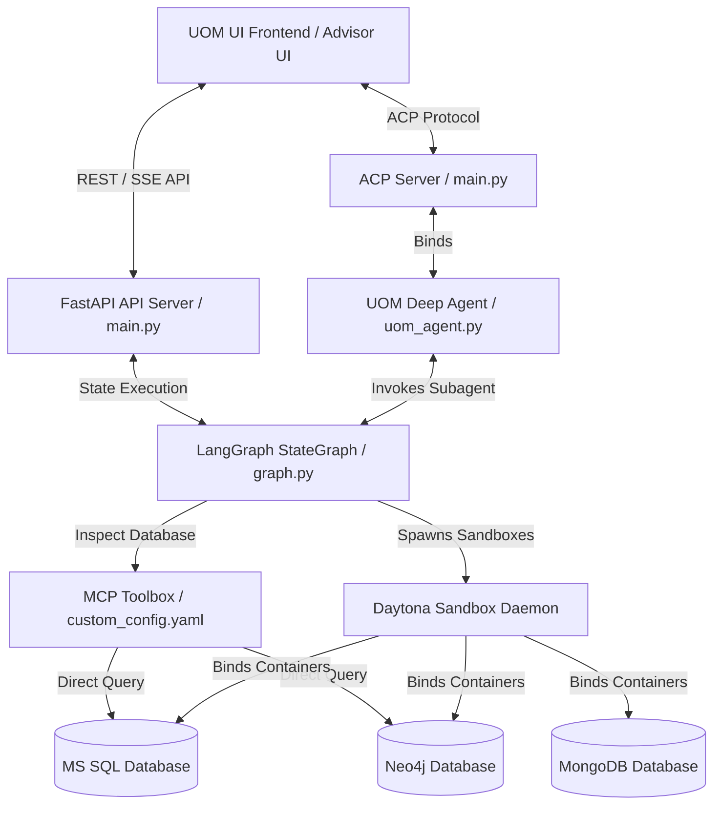
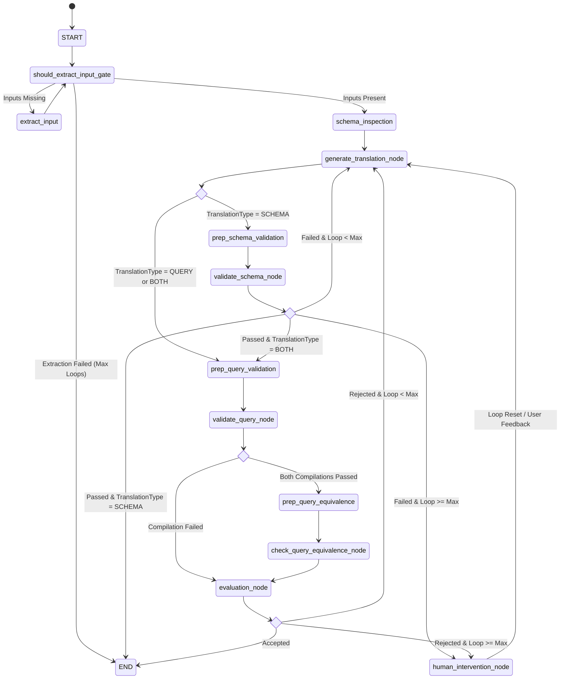

# Universal Object Mapping (UOM) Orchestrator: System Architecture & LangGraph Design

The Universal Object Mapping (UOM) Orchestrator serves as the central orchestration engine for executing, validating, and evaluating translations between Object-Relational Mapping (ORM) paradigms (relational .NET structures) and NoSQL Document/Graph schemas (Java MongoDB and Neo4j architectures). 

Rather than relying on unstructured, single-agent tool loops (which suffer from token bloat, high latencies, and regression bugs), the system is built as a highly deterministic, stateful workflow using **LangGraph**. This architecture implements strict structural validation gates, compiling target schemas and checking target queries against isolated compiler sandboxes before assessing equivalence or committing results.

---

## 1. System Topology and Boundaries

The UOM Orchestrator sits between the client-facing UI (UOM UI Web App) and isolated execution environments (Daytona validation sandboxes). The primary execution sequence coordinates the following system bounds:

---

## 2. Comprehensive LangGraph Workflow

The orchestrator’s execution sequence is modeled as a `StateGraph` which determines execution paths, compiler validation, and equivalence checks. The workflow transitions through a series of specialized nodes and conditional edges.

### 2.1 The State Machine Diagram

The following Mermaid diagram outlines the precise, step-by-step state machine implemented in `react_agent/graph.py`:

---

## 3. Node-by-Node Functional Breakdown

Each node in the state machine is a stateless python function taking the current `State`, a `RunnableConfig`, and the context `Runtime` as parameters, and returns state updates or a `Command` object to control routing.

| Node Name | Source Module | Primary Functionality | Dynamic Capabilities & Details |
| :--- | :--- | :--- | :--- |
| `extract_input` | `react_agent/graph.py` | Analyzes unstructured chat history to parse translation inputs. | Uses `EINFRA_QWEN3_CODER_NEXT` with strict Pydantic formatting to resolve `source_schema_code`, `source_query_code`, framework types, and versions. Increments `extraction_loop_count`. |
| `schema_inspection` | `react_agent/graph.py` | Connects to running database engines via MCP to retrieve schema context. | Uses a ReAct agent with custom database toolbox and MongoDB MCP tools. Automatically generates contextual summaries of SQL tables, neo4j labels, and mongo collections, saving them to `state.schema_context` to avoid message context bloat. |
| `generate_translation_node` | `react_agent/graph.py` | Core structured code generator translating inputs to target. | Dynamically constructs a Pydantic output model using Pydantic `create_model` on the fly to exclude irrelevant fields based on the `translation_type` (SCHEMA, QUERY, or BOTH), optimizing token efficiency. |
| `prep_schema_validation` | `react_agent/graph.py` | Prepares compiler tool invocation payload for schema validation. | Inspects the target framework (C# or Java) and structures a mock `validate_dotnet_code` or `validate_java_code` tool call message with the target schema validation code. |
| `validate_schema_node` | `react_agent/graph.py` | Execution node for compiling schema validation code in sandboxes. | Executes compilation and unit fetching within Daytona sandboxes using `dotnet build` or `mvn clean compile`. |
| `prep_query_validation` | `react_agent/graph.py` | Injects parallel sandbox compiler tool calls for source/target queries. | Formulates two concurrent tool calls (`validate_dotnet_code` for source SQL/LINQ C# code and `validate_java_code` for target Java MongoDB/Neo4j queries). |
| `validate_query_node` | `react_agent/graph.py` | ToolNode executing parallel source/target query compilation & runs. | Compiles and executes both queries within Daytona sandboxes concurrently. Captures return JSON results (`count`, `firstSample`, `lastSample`) and stores them in state. |
| `prep_query_equivalence` | `react_agent/graph.py` | Formulates the semantic comparison payload. | Structures a tool call for `check_query_equivalence` passing the two JSON outputs generated by the sandboxes. |
| `check_query_equivalence_node` | `react_agent/graph.py` | Execution node for deep query equivalence testing. | Runs the `check_query_equivalence` tool, which delegates to background threads to compute deep differences using `deepdiff.DeepDiff`. |
| `evaluation_node` | `react_agent/graph.py` | Structured judge assessing compilation results and equivalence diffs. | Utilizes Kimi K2.6 to read all validator outcomes, sandbox print logs, and DeepDiff results, outputting a structured `ACCEPT` or `REJECT` decision with granular reasoning. |
| `human_intervention_node` | `react_agent/graph.py` | Pauses graph execution to solicit developer input. | Employs LangGraph’s `interrupt()` API to surface current generated code, evaluation error logs, and deep diffs to the user, blocking until manual `accept` or `reject` (with feedback) is submitted. |

---

## 4. Conditional Transition Routing

Conditional routing determines the state machine's transitions. This layer is modeled using deterministic python functions returning `Literal` branch names:

### 4.1 Initial Extraction Gate (`should_extract_input`)
Executed after `START` and `extract_input`.
- **Route to `schema_inspection`**: If all required structured parameters exist (source code and target frameworks matching the requested `translation_type`).
- **Route to `extract_input`**: If required parameters are missing and `state.extraction_loop_count < MAX_EXTRACTION_LOOPS` (3).
- **Route to `__end__` (END)**: If inputs remain un-extracted after 3 attempts, exiting with an error explanation printed to conversation history.

### 4.2 Generation Gate (`route_post_translation`)
Executed after `generate_translation_node`.
- **Route to `prep_schema_validation`**: If `state.translation_type == TranslationType.SCHEMA`.
- **Route to `prep_query_validation`**: If `state.translation_type` is either `QUERY` or `BOTH`.

### 4.3 Schema Validation Gate (`route_post_schema_validation`)
Executed after `validate_schema_node`.
- **Route to `prep_query_validation`**: If schema compilation succeeded and the translation type requested is `BOTH`.
- **Route to `__end__` (END)**: If schema validation succeeded and only `SCHEMA` translation was requested.
- **Route to `generate_translation_node`**: If schema compilation failed due to syntax or mapping errors, and `state.translation_loop_count < MAX_TRANSLATION_LOOPS` (3). The compiler stderr logs are passed in `translation_messages` so the LLM has direct debug context.
- **Route to `human_intervention_node`**: If schema compilation failed and the loop count has reached `MAX_TRANSLATION_LOOPS` (3).

### 4.4 Query Validation Gate (`route_post_query_validation`)
Executed after `validate_query_node`.
- **Route to `prep_query_equivalence`**: If **both** source and target query validations compiled and executed successfully (returning standard `[Validation Passed]` markers).
- **Route to `evaluation_node`**: If **either** source or target compilation or execution failed (e.g. C# compiles but Java throws a Driver Connection Timeout). Skipping equivalence checking saves resources and lets the judge node format the errors.

### 4.5 Evaluation Gate (`route_post_evaluation`)
Executed after `evaluation_node`.
- **Route to `__end__` (END)**: If the judge issued an `ACCEPT` decision.
- **Route to `generate_translation_node`**: If the judge issued `REJECT` and `state.translation_loop_count < MAX_TRANSLATION_LOOPS` (3).
- **Route to `human_intervention_node`**: If the judge issued `REJECT` and loop count is exhausted.

---

## 5. Architectural Shifts: Deprecation of the ReAct Translation Agent

Historically, the orchestrator relied on a unified **ReAct Translation Agent** (`translation_agent` node in `graph.py`, currently marked as deprecated). Under that setup, the LLM was given direct access to sandboxes and database tools, tasked with autonomously compiling code, checking logs, and deciding when it was done.

While highly flexible in theory, this pattern suffered from major flaws:
1. **Context Window Explosion**: Every single tool call, build log, and compiler stderr trace was written directly to the main conversation thread. An agent looping 5 times to fix syntax errors would ingest over 80,000 tokens of noisy logs, causing severe context window pollution, high API costs, and degraded reasoning.
2. **Hallucinated Outcomes**: ReAct agents occasionally failed to interpret a non-zero exit code or compiler failure correctly, hallucinating that a broken script had "succeeded" and returning incorrect schemas to the user.
3. **Lack of Parallelism**: Standard sequential ReAct loops execute tool calls one-by-one. In contrast, the current architecture runs the source and target validations concurrently in separate sandboxes, cutting validation latency in half.

### Comparison Table: ReAct Loop vs. Deterministic State Machine

| Architectural Attribute | Historical ReAct Agent (Deprecated) | Current Deterministic Pipeline |
| :--- | :--- | :--- |
| **State Transitions** | Unstructured; decided by LLM action selection. | Explicitly modeled; state machine defined in Python. |
| **Tool Execution** | Sequential, autonomous, and slow. | Concurrent, structured, and fast. |
| **Context Management** | Noisy compiler/build logs polluting the chat thread. | Isolated `translation_messages` queue; summaries in `schema_context`. |
| **Correctness Guarantee** | High rates of false successes; LLM self-reports correctness. | Multi-layered validation gates: compiler check -> deep diff check -> separate LLM judge. |
| **Failure Resolution** | Retries indefinitely until token limits or timeouts hit. | Explicit cap (`MAX_TRANSLATION_LOOPS=3`), then graceful pause for human input via `interrupt()`. |
