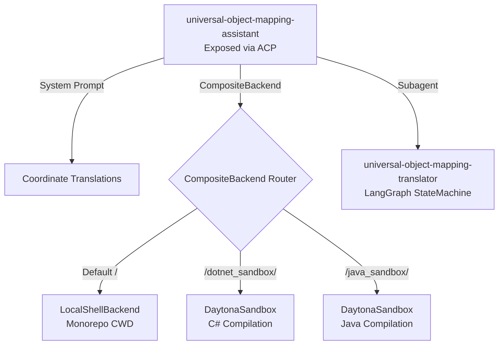

# UOM Orchestrator: DeepAgent Architecture & ACP Integration

To expose translation capabilities to external IDE extensions and command-line interfaces, the orchestrator incorporates a **DeepAgent** reasoning wrapper and an **Agent Communication Protocol (ACP)** server. This architecture allows the translator to run as an autonomous programming agent that can inspect local workspace structures, manage file edits, and compile code.

---

## 1. DeepAgent Workspace Composition (`uom_deep_agent/uom_agent.py`)

The DeepAgent wrapper, built using the LangChain DeepAgents SDK, integrates the primary LangGraph translation workflow as a specialized subagent. It wraps this graph with conversational reasoning, filesystem access, and environment backends.



### 1.1 The Composite Backend Router

The assistant interacts with multiple isolated execution environments. It utilizes a `CompositeBackend` to dynamically route filesystem and terminal execution requests based on URI prefixes:
- **Default Route (`/`)**: Directs to `LocalShellBackend`. This gives the agent direct read/write access to the user's active monorepo workspace on the host machine.
- **Dotnet Sandbox Route (`/dotnet_sandbox/`)**: Directs to `DaytonaSandbox(ValidationSandbox.SANDBOXES[SandboxType.DOTNET_10_SANDBOX])`.
- **Java Sandbox Route (`/java_sandbox/`)**: Directs to `DaytonaSandbox(ValidationSandbox.SANDBOXES[SandboxType.JAVA_25_SANDBOX])`.
- **State Storage (`/memories/` & `/conversation_history/`)**: Directs to an ephemeral `StateBackend` for tracking runtime variables across sessions.

### 1.2 verbatims Subagent Prompts

To prevent the agent from truncating or altering source code blocks before passing them to the compilation validators, the DeepAgent system prompt enforces strict **verbatim reproduction rules**:
> [!IMPORTANT]
> The system prompt mandates: *"Always call 'universal-object-mapping-translator' sub-agent to perform the translation with the FULL user input message and code. Do NOT truncate or modify it. Do NOT include any additional text apart from the initial 'user input'."*

This guarantees that raw code inputs are passed exactly as provided by the user into the validation sandboxes, avoiding syntax errors caused by LLM summarization.

---

## 2. Parallel Local Context Middleware (`uom_deep_agent/local_context.py`)

When the assistant starts, it needs to analyze the user's project structure (such as language, virtual environments, uncommitted git files, and directory layout) to gather context. 

To perform this check without slowing down the agent startup, the `LocalContextMiddleware` runs a highly optimized context detection script.

### 2.1 Parallel Background Subshells

Instead of executing detection commands sequentially (which would block execution for several seconds), the bash script executes sections in parallel as background subshells, writing output to temporary files:

```bash
# Independent sections are run as parallel background processes in subshells
( _section_package_managers ) > "$_DCT/02_pkgmgr" 2>"$_DCT/02_pkgmgr.err" &
( _section_runtimes         ) > "$_DCT/03_runtimes" 2>"$_DCT/03_runtimes.err" &
( _section_git              ) > "$_DCT/04_git" 2>"$_DCT/04_git.err" &
( _section_test_command     ) > "$_DCT/05_testcmd" 2>"$_DCT/05_testcmd.err" &
( _section_files            ) > "$_DCT/06_files" 2>"$_DCT/06_files.err" &
( _section_tree             ) > "$_DCT/07_tree" 2>"$_DCT/07_tree.err" &
( _section_makefile         ) > "$_DCT/08_makefile" 2>"$_DCT/08_makefile.err" &
wait # Wait for all background jobs to finish
cat "$_DCT/02_pkgmgr" "$_DCT/03_runtimes" ... # Concatenate in display order
```

This parallel execution ensures the entire environment inspection completes in under 100ms.

### 2.2 Defensive Tool Probing
The script uses `command -v` to check for the existence of external tools (like `git`, `tree`, `python3`, or `node`) before attempting to use them, preventing shell errors in empty or minimal container environments.

### 2.3 Caching Refreshes via Summarization Cutoffs

Rerunning this detection script on every single user turn is redundant. However, if the environment changes (e.g. the agent runs a test command or edits a file), the context must be refreshed.

To optimize this, the middleware tracks the private state attribute `_local_context_refreshed_at_cutoff`:
- When a **Summarization Event** occurs (indicating a chunk of messages has been processed and saved), the middleware detects the new `cutoff_index`.
- It refreshes the context only if the current `cutoff_index` does not match `_local_context_refreshed_at_cutoff`.
- This ensures the local context is refreshed only when meaningful environment modifications have occurred.

---

## 3. Agent Communication Protocol (ACP) Server (`uom_acp/main.py`)

The ACP server wraps the compiled DeepAgent, exposing it as a standard service that external developer environments can connect to.

### 3.1 Session Authorization Modes

The server configures three distinct operational security profiles that dictate how the agent handles writes, edits, and terminal executions:

| Mode ID | Mode Name | Behavior | Security Level |
| :--- | :--- | :--- | :--- |
| `ask_before_edits` | Ask before edits | Intercepts all write operations, directory creations, plans, and terminal commands, prompting the user for approval. | **Strict / Safe** (Default for production) |
| `accept_edits` | Accept edits | Auto-approves file writes and code edits, but still prompts for user approval before executing any terminal commands or plans. | **Balanced** (Default for development) |
| `accept_everything` | Accept everything | Automatically executes all actions, writes, and commands without prompting the user. | **Fully Autonomous** (Use with caution) |

These modes are configured in `uom_acp/main.py` using `SessionModeState` and mapped to LangGraph interrupts:

```python
modes = SessionModeState(
    current_mode_id="accept_edits",
    available_modes=[
        SessionMode(id="ask_before_edits", ...),
        SessionMode(id="accept_edits", ...),
        SessionMode(id="accept_everything", ...),
    ],
)
```

### 3.2 The ACP Lifecycle Main Loop

The server entry point handles sandbox allocation and runs the ACP session:

```python
async def _serve_uom_deep_agent() -> None:
    # 1. Warm up the LLMs and cache client connections
    for m in [AvailableModel.EINFRA_DEEPSEEK_V4_PRO_THINKING, ...]:
        MODELS[m.value] = await load_chat_model(m.value, ...)

    async with AsyncDaytona() as daytona:
        # 2. Allocate and warm up Daytona sandboxes
        dotnet_sandbox = DaytonaSandbox(sandbox = await ValidationSandbox.get_sandbox(daytona, SandboxType.DOTNET_10_SANDBOX, print))
        java_sandbox = DaytonaSandbox(sandbox = await ValidationSandbox.get_sandbox(daytona, SandboxType.JAVA_25_SANDBOX, print))
        
        # 3. Define the agent builder factory
        def build_agent(context: AgentSessionContext) -> CompiledStateGraph:
            return build_deep_agent(..., dotnet_sandbox=dotnet_sandbox, java_sandbox=java_sandbox, context=context)

        # 4. Instantiate and run the ACP server
        acp_agent = AgentServerACP(agent=build_agent, modes=modes, models=models)
        await run_acp_agent(acp_agent)
```

This ensures that whenever an IDE client connects via the ACP protocol:
- The required Daytona validation sandboxes are already warmed up and cached.
- The session is bound to the user's selected authorization mode (`ask_before_edits` or `accept_edits`).
- Dynamic LLM provider switching is supported on the fly without restarting the service.
