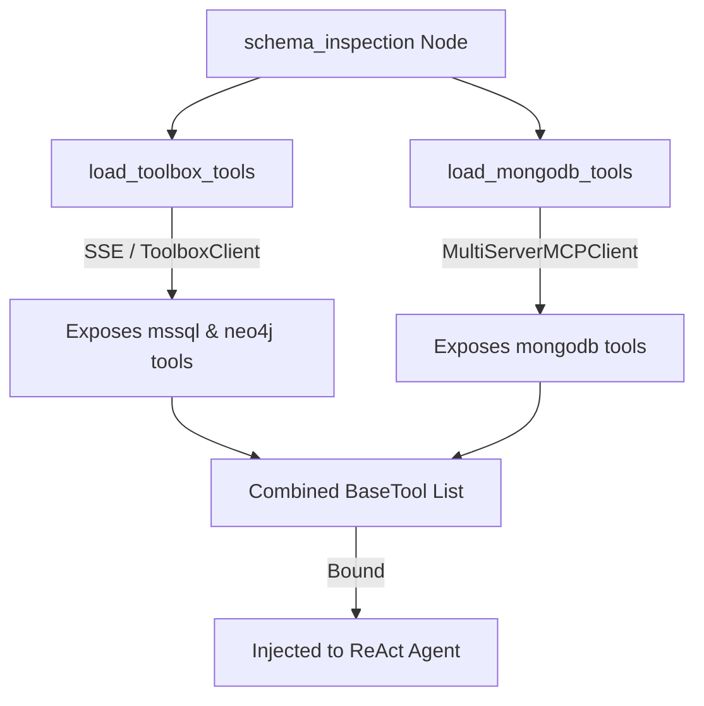

# UOM Orchestrator: MCP Database Toolbox & Schema Inspection

To ensure accurate database translations, the orchestrator must inspect the schemas of the source and target databases. The UOM Orchestrator achieves this by integrating with the **Model Context Protocol (MCP)**, loading schema inspection tools from running MCP servers dynamically.

---

## 1. The Role of MCP in Database Schema Inspection

During the initial phase of the translation workflow, the `schema_inspection` node uses an LLM equipped with database tools. This node executes inspection queries against:
- **Microsoft SQL Server (Source)**: Retrieving table schemas, column types, primary keys, and foreign key relationships.
- **Neo4j (Target)**: Inspecting node labels, relationship types, and properties.
- **MongoDB (Target)**: Examining document structures, collection lists, and validators.

These tools are retrieved dynamically from two running MCP servers:
1. **Generic Database Toolbox**: Exposes tools for executing Cypher statements, viewing relational tables, and extracting metadata.
2. **MongoDB MCP Server**: Exposes collection-level management and query execution tools.

---

## 2. Dynamic Configuration Synchronization (`modify_toolbox_sources`)

The Database Toolbox MCP server runs as a separate service (often inside its own Docker container). When the orchestrator context loads, connection strings (like `localhost:1333` for SQL Server) are read from environment variables. 

### 2.1 The Localhost Resolution Problem
If the Database Toolbox container attempts to connect to `localhost:1333`, it resolves to **itself** (the toolbox container), rather than the host machine or Daytona workspace databases, causing immediate connection failures.

### 2.2 Host Gateway Translation
To prevent this, the custom tool manager (`mcp_database.py`) uses `translate_localhost_to_host_gateway` to replace `localhost` or `127.0.0.1` with the Docker host gateway IP:
- **Default Gateway**: Resolves to `host.docker.internal` (or a custom `OUTER_HOST_GATEWAY_IP` provided by the Daytona network bridge).
- **MSSQL Connection Parsing**: `extract_mssql_connection_info` parses the connection string using a strict regex pattern to extract connection parameters (host, port, database, user, password) needed to populate the MCP configuration:
  ```python
  pattern = re.compile(
      r"Server=(?P<host>[^,;]+),(?P<port>\d+);Database=(?P<database>[^;]+);User Id=(?P<user>[^;]+);Password=(?P<password>[^;]+);?"
  )
  ```

### 2.3 Overwriting settings Files Dynamically
Once translated, the orchestrator writes the data source credentials directly to the Database Toolbox settings file located at `config/db_toolbox/custom_config.yaml` using asynchronous file I/O:

```python
db_toolbox_path = os.path.join(get_config_dir(), "db_toolbox", "custom_config.yaml")
data_sources = {
    "mssql-source": {
        "kind": "mssql",
        "host": mssql_conn_info["host"],
        "port": mssql_conn_info["port"],
        "database": mssql_conn_info["database"],
        "user": mssql_conn_info["user"],
        "password": mssql_conn_info["password"],
    },
    "neo4j-source": {
        "kind": "neo4j",
        "uri": translate_localhost_to_host_gateway(context.neo4j_uri),
        ...
    }
}
async with aiofiles.open(db_toolbox_path, "w") as f:
    await f.write(yaml.dump({"sources": data_sources}))
```

---

## 3. Dynamic Tool Binding

The orchestrator connects to MCP servers asynchronously and maps their tools to LangChain-compatible schemas.



### 3.1 Loading Database Toolbox Tools (`load_toolbox_tools`)
- The loader connects to the server using the `ToolboxClient` SSE wrapper:
  ```python
  async with ToolboxClient(toolbox_uri) as toolbox_client:
      toolbox_tools = await toolbox_client.aload_toolset()
  ```
- The loaded tools are cast to LangChain `BaseTool` objects and returned to the schema inspection node.

### 3.2 Loading MongoDB Tools (`load_mongodb_tools`)
- To connect to the MongoDB MCP server, the loader instantiates a `MultiServerMCPClient` with `tool_name_prefix=True`:
  ```python
  db_mcp_client = MultiServerMCPClient(
      {"mongodb": {"transport": "streamable_http", "url": mongodb_mcp_uri}},
      tool_name_prefix=True
  )
  async with db_mcp_client.session("mongodb") as db_mcp_session:
      db_tools = await load_mcp_tools(db_mcp_session)
  ```
- Enabling `tool_name_prefix=True` prefixes MongoDB tools with `mongodb_` (e.g. `mongodb_list_collections`), preventing naming collisions with other tools.

---

## 4. Exception Safety & Fallback Policies

Connecting to remote MCP servers introduces potential failure points:
- The database engine or Database Toolbox container might be temporarily down or starting up.
- Network glitches can trigger connection timeouts.
- Dynamic schema binding can raise `BrokenResourceError` in AnyIO sessions.

If the orchestrator crashed on these exceptions, it would block the entire translation pipeline. To prevent this, both tool loaders implement a **Defensive Catch-and-Fallback Policy**:

```python
try:
    async with ToolboxClient(toolbox_uri) as toolbox_client:
        ...
        yield cast(list[BaseTool], toolbox_tools)
except* (BrokenResourceError, CancelledError, RuntimeError, Exception):
    logger.warning(
        "Failed to load database tools from toolbox server at %s. Proceeding without database tools.",
        toolbox_uri,
        exc_info=True
    )
    yield []
```

### 4.1 Exception Group Filtering (`except*`)
By using Python's `except*` block, the orchestrator filters and catches exception groups (such as parallel AnyIO resource crashes) without letting them escape.

### 4.2 Graceful Failure Degradation
Instead of raising a fatal runtime error:
1. The tool loaders log a warning with the full stack trace for debugging.
2. They yield an **empty list** (`[]`) back to the schema inspection node.
3. The ReAct agent continues executing without access to schema tools.
4. The agent falls back to performing the translation using the user's raw inputs and its static training data.

This architecture ensures high availability, allowing the orchestrator to perform translations even under compromised database connection conditions.
