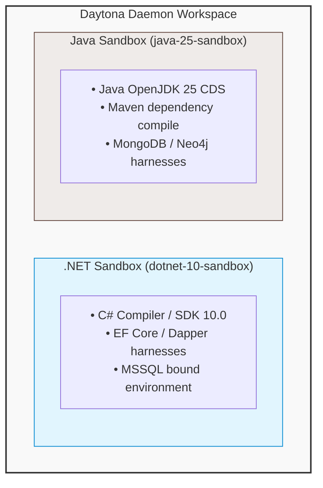
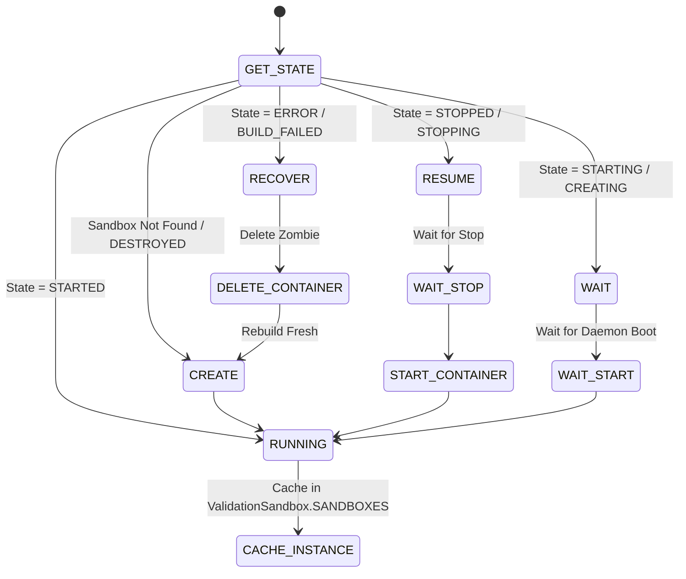

# UOM Orchestrator: Isolated Daytona Sandboxes & Lifecycle Management

Executing untrusted, dynamically generated C# or Java code presents severe security and environmental stability risks. To solve this, the UOM Orchestrator executes all compilation, build, and database query evaluations inside isolated **Daytona Sandbox** environments. 

These sandboxes are secure, lightweight Docker container instances managed via the Daytona Workspace API, ensuring that code translations are compiled and run under strict, repeatable conditions.

---

## 1. Sandbox Topology & Container Specifications

The orchestrator manages two distinct sandbox profiles based on the target languages required for translation validation:



1. **.NET Sandbox (`dotnet-10-sandbox`)**:
   - **Base Image**: `mcr.microsoft.com/dotnet/sdk:10.0`
   - **Capabilities**: Compiles C# Program.cs and .csproj files, loads EF Core, Dapper, and NHibernate packages, and runs relational query loops connecting to SQL Server.
2. **Java Sandbox (`java-25-sandbox`)**:
   - **Base Image**: `bellsoft/liberica-openjdk-debian:25-cds`
   - **Capabilities**: Installs `maven` CLI tool, downloads Maven dependencies (Spring Data MongoDB, Spring Data Neo4j), compiles public classes, and executes target queries against graph or document engines.

---

## 2. Environment Snapshotting & Caching

Bootstrapping a raw Docker container, downloading the Maven dependency tree, and configuring C# assemblies for every code evaluation takes minutes. To make the translation loop interactive, the `ValidationSandbox` manager (in `utils/sandboxes.py`) implements a **Snapshot Caching and Provisioning Pattern**.

### 2.1 Baseline Snapshots

Before booting a container, the orchestrator builds a clean base environment snapshot named `validation-snapshot-<type>`. 
- For `.NET`, it preserves the pre-configured SDK state.
- For `Java`, it runs `apt-get update && apt-get install -y maven` and caches the image.

Once a snapshot is created, Daytona caches it. Subsequent sandboxes are cloned from this snapshot instantly (taking less than 2 seconds), bypassing environment installation overhead entirely.

### 2.2 Snapshot Exponential Backoff Retry Loop

Creating snapshots involves heavy network operations (pulling large SDK images, fetching apt packages). Under high loads, these tasks are susceptible to rate limits (e.g. Docker Hub API limits) or transient timeouts.

To mitigate this, `ValidationSandbox.create_snapshot` wraps snapshot generation in an exponential backoff loop:

```python
max_retries = 5
for attempt in range(max_retries):
    try:
        # 1. Attempt to fetch pre-existing cached snapshot
        existing_snapshot = await daytona.snapshot.get(params.name)
        return
    except Exception:
        # 2. If not found, attempt to build a new one
        try:
            snapshot = await daytona.snapshot.create(params, on_logs=...)
            break
        except Exception as e:
            # 3. Apply exponential backoff delay if it fails
            if attempt < max_retries - 1:
                delay = 2 ** attempt
                await asyncio.sleep(delay)
            else:
                raise
```

The wait delay scales mathematically:
$$\text{delay} = 2^{\text{attempt}} \text{ seconds}$$

This results in a progression of $1s, 2s, 4s, 8s$, ensuring that the builder does not overwhelm the daemon during temporary outages.

---

## 3. Container Lifecycle State Transitions

The container state machine is managed in `utils/sandboxes.py` through `create_validation_sandbox`. It must handle multiple complex Daytona container states gracefully to prevent orphan instances, resource locks, or system hangs:



### 3.1 Zombie Recovery (`ERROR` / `BUILD_FAILED` states)
If a previous execution crashed, or the Daytona daemon lost connection to the Docker socket, a sandbox can get locked in an `ERROR` or `BUILD_FAILED` state. If left unmanaged, the orchestrator will fail on all subsequent runs.
- **Mitigation**: The lifecycle manager proactively intercepts these states, calls `await daytona.delete(sandbox_instance)`, pauses for 5 seconds for cleanup, and forces a clean rebuild of the container from the snapshot.

### 3.2 Sleep Recovery (`STOPPED` / `STOPPING` states)
To conserve host CPU and memory resources, sandboxes are configured to auto-stop after 60 minutes of inactivity (`auto_stop_interval=60`). When a dormant thread wakes up, it encounters a `STOPPED` container.
- **Mitigation**: The manager checks if the state is `STOPPED`. It calls `await sandbox_instance.start()` and blocks via `await sandbox_instance.wait_for_sandbox_start(timeout=180)` to restore the hot cached sandbox environment before issuing execution commands.

---

## 4. Sandbox Execution Primitives

Once the sandboxes are running, the custom tool wrappers (`sandbox_tools.py`) perform file and shell operations within the containers.

### 4.1 Execution Sessions (`execute_in_sandbox`)

To prevent multi-threaded jobs from corrupting one another's files, each code validation creates a unique, ephemeral execution session:

```python
session_id = f"{sandbox.name}-{uuid4()}"
await sandbox.process.create_session(session_id)
```

The command script (e.g. `Program.cs` compilation or `run.sh` execution) is transferred into this session.

### 4.2 Real-time Console Log Streaming

To provide a responsive interface for the user, compiler and program console logs must be streamed back to the UOM UI frontend in real time, rather than waiting for the entire process to finish executing.

This is implemented using Daytona's asynchronous streaming log API coupled with a custom event hook inside the tool:

```python
asyncio.create_task(
    sandbox.process.get_session_command_logs_async(
        session_id,
        exec_response.cmd_id,
        lambda stdout: process_streaming_chunks(stdout, lambda chunk: custom_event_stream_writer(chunk, "stdout")),
        lambda stderr: process_streaming_chunks(stderr, lambda chunk: custom_event_stream_writer(chunk, "stderr")),
    )
)
```

- **Broadcasting Channels**: The streamed stdout/stderr chunks are mapped to specialized LangGraph event keys (`DOTNET_SANDBOX_COMMAND_EXECUTION_STDOUT`, `JAVA_SANDBOX_COMMAND_EXECUTION_STDERR`, etc.) via `runtime.stream_writer`.
- **User Feedback**: The frontend UI intercepts these events to render a simulated UNIX terminal panel, letting the user watch C# compiler builds and Java Maven dependency resolution live.

### 4.3 Output Extraction via Filesystem API (`download_file_from_sandbox`)

Once execution finishes with a success status, the validation program writes its data output to a designated directory in the sandbox filesystem (`/sandbox/<thread_id>/results/`). 

To retrieve this file, the validator calls `download_file_from_sandbox`:
1. It reads the remote output path produced by the execution shell.
2. It calls the Daytona FS API: `await sandbox.fs.download_file(remote_path)`.
3. The returned raw byte array is decoded to a UTF-8 string, parsed via `orjson.loads`, and written back to the LangGraph state machine.
