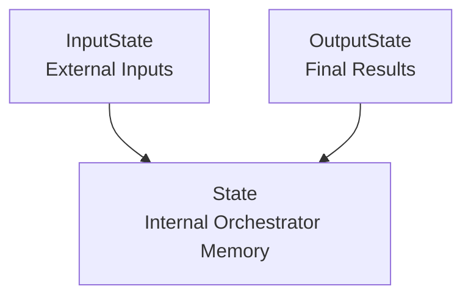
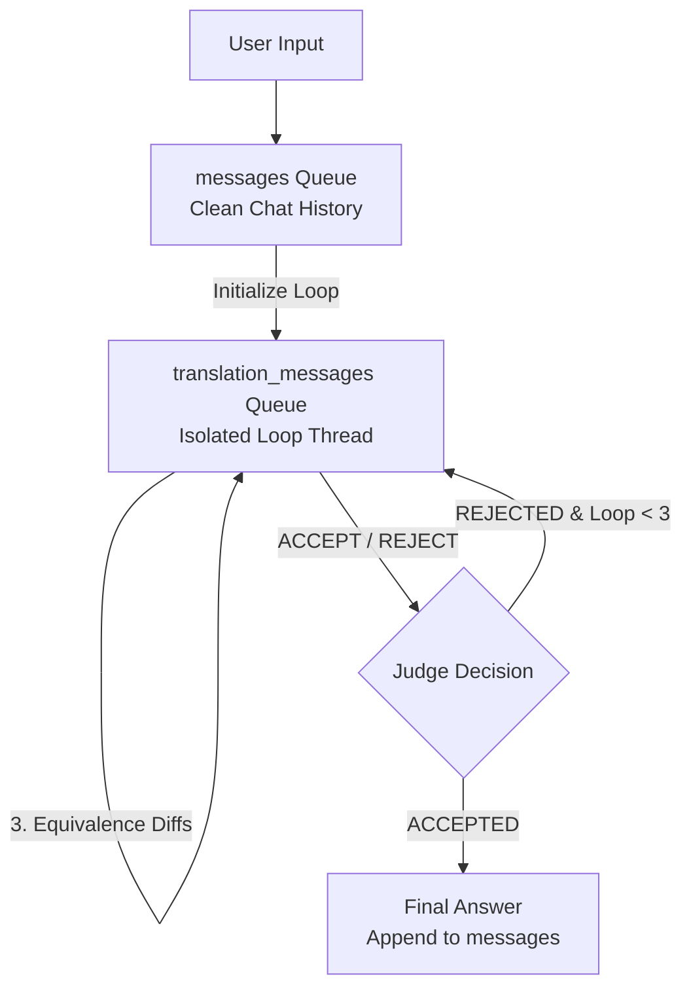

# UOM Orchestrator: State Representation, Message Isolation & Runtime Context

State management is the backbone of the Universal Object Mapping (UOM) Orchestrator. By utilizing LangGraph’s stateful modeling and structured dataclasses, the service maintains thread-scoped memory, captures intermediate execution artifacts, and applies runtime configurations dynamically.

---

## 1. LangGraph State Structure

The state representation of the orchestrator is split across three distinct dataclasses located in `react_agent/state.py`:
- `InputState`: Defines the narrower external boundary representing the data supplied by the client during a request.
- `OutputState`: Defines the final schemas, queries, validation logs, and explanations returned to the client upon completion.
- `State`: Inherits from both `InputState` and `OutputState`, and incorporates internal tracking variables, results caches, and retry loops.



### 1.1 State Class Attribute Matrix

| Attribute Name | Type | Class Bound | Purpose |
| :--- | :--- | :--- | :--- |
| `messages` | `Annotated[Sequence[AnyMessage], add_messages]` | `InputState` / `OutputState` | Tracks the primary conversation history between the user and the assistant. |
| `source_schema_code` | `str \| None` | `InputState` | The raw relational schema C# source code submitted by the user. |
| `source_query_code` | `str \| None` | `InputState` | The raw relational LINQ query C# source code submitted by the user. |
| `translation_type` | `TranslationType \| None` | `InputState` | Scope of the translation (`SCHEMA`, `QUERY`, or `BOTH`). |
| `source_target` | `FrameworkEnum \| None` | `InputState` | Standardized origin framework identifier (e.g., `DOTNET_EFCORE`). |
| `source_target_version` | `str \| None` | `InputState` | Target version of the source database library if specified. |
| `destination_target` | `FrameworkEnum \| None` | `InputState` | Standardized target framework identifier (e.g., `JAVA_SPRING_DATA_MONGODB`). |
| `destination_target_version` | `str \| None` | `InputState` | Target version of the destination database library if specified. |
| `translated_schema_code` | `str \| None` | `OutputState` | The successfully compiled target Java schema entities and context configs. |
| `translated_query_code` | `str \| None` | `OutputState` | The successfully compiled target Cypher or Mongo query strings. |
| `source_validation_schema_code`| `str \| None` | `OutputState` | Full, runnable C# validation class containing mock contexts. |
| `source_validation_harness_code`| `str \| None` | `OutputState` | Runnable C# console app containing LINQ query execution & JSON serialization. |
| `target_validation_schema_code`| `str \| None` | `OutputState` | Full, runnable Java validation class containing driver settings. |
| `target_validation_harness_code`| `str \| None` | `OutputState` | Runnable Java console app containing Cypher/Mongo executions & JSON dumps. |
| `explanation_message` | `str \| None` | `OutputState` | Final structural evaluation critique or successful validation report. |
| `source_validation_entry_type_name` | `str \| None` | `State` (Internal) | Entrypoint class name used by the sandbox to execute C# validation. |
| `target_validation_entry_type_name` | `str \| None` | `State` (Internal) | Entrypoint class name used by the sandbox to execute Java validation. |
| `source_query_validation_results`| `QueryValidationResults \| None`| `State` (Internal) | Extracted JSON payload containing count, first row sample, and last row sample from source query. |
| `target_query_validation_results`| `QueryValidationResults \| None`| `State` (Internal) | Extracted JSON payload containing count, first row sample, and last row sample from target query. |
| `query_equivalence_deep_diffs`| `dict[str, QueryEquivalenceDeepDiff] \| None`| `State` (Internal) | Comparative evaluation differences generated by DeepDiff. |
| `schema_context` | `str` | `State` (Internal) | Ground-truth database mappings retrieved via MCP tools prior to translation. |
| `translation_messages` | `Annotated[Sequence[AnyMessage], add_messages]` | `State` (Internal) | Isolated thread specifically for the compile-and-retry generation cycles. |
| `extraction_loop_count` | `int` | `State` (Internal) | Counter tracking initial input parsing retry attempts. |
| `translation_loop_count` | `int` | `State` (Internal) | Counter tracking compilation / validation retry loops (capped at 3). |

---

## 2. Message Isolation Boundary

One of the most important design decisions in the orchestrator is the separation of `messages` and `translation_messages`. 

### 2.1 The Problem: Context Window Pollution
In standard LangGraph implementations, all conversational interactions (chat bubbles, tool invocation logs, and execution errors) are appended to a single, monolithic message list. 

During ORM translation, the compiler validators inside Daytona frequently return very large outputs (such as Maven build logs containing dependency traces, C# MSBuild compile warning sequences, or hundreds of lines of stack traces). If these logs are appended directly to the user's primary chat thread:
1. **Model Distraction**: The LLM starts referencing past compilation logs instead of focusing on the latest instructions or user edits.
2. **High Latency and API Cost**: The prompt size increases exponentially on every turn. A single chat session can easily hit 150,000 tokens, resulting in massive billing costs and slow inference.
3. **Loss of History**: Crucial user requirements or design decisions discussed at the beginning of the conversation get squeezed out due to context window truncation.

### 2.2 The Solution: Isolated Sub-Graph Messaging
The orchestrator maintains an isolated thread for compile-and-retry loops inside `state.translation_messages`:



1. **Clean Main Thread**: When the user requests a translation, the inputs are injected into the isolated `translation_messages` queue.
2. **Iterative Refinement**: All compilation errors, DeepDiff outputs, and model corrections are logged to `translation_messages`. The core conversational thread remains completely untouched.
3. **Garbage Collection of Noise**: Once the translation is completed (either successfully accepted or sent to the human-in-the-loop node), only the final, functional schema/query code and a concise evaluation summary are written back to `messages`. The dirty, multi-megabyte compilation trails are discarded from the primary chat history.

---

## 3. Configuration Context (`react_agent/context.py`)

Deployment-specific parameters, credentials, connection ports, and timeouts are encapsulated in the `Context` class. Built as a Pydantic-dataclass, it provides strong typing, schema descriptions, and automatic binding to system environments.

### 3.1 Eager Environment Binding via Reflection

When a LangGraph graph compiles and executes, it initializes its configurations. If a configuration class is instantiated with blank properties, it can cause immediate execution failures. 

To solve this, `Context` overrides `__post_init__` using Python’s reflection capabilities:

```python
def __post_init__(self) -> None:
    # Iterate over all dataclass fields using reflection
    for f in fields(self):
        # Skip fields that are explicitly marked as not intended for initialization
        if not f.init:
            continue

        # If the field value currently equals the default value defined in the class,
        # it means the user did not explicitly override it during instantiation.
        # In this case, we eagerly check the environment variables (e.g. 'OPENAI_API_KEY').
        # This ensures that even if instantiated empty, the context binds securely to the deployment environment.
        if getattr(self, f.name) == f.default:
            setattr(self, f.name, os.environ.get(f.name.upper(), f.default))
```

This guarantees that:
- Any custom runtime parameters specified in `RunnableConfig["configurable"]` take immediate precedence.
- If no values are passed in the execution configuration, the class falls back to environment variables.
- Standard default constants are applied if neither is present, keeping the server robust.

### 3.2 Key Configurable Parameters

The following parameters are tracked by `Context` to govern external tool connections:

| Parameter Name | Target Env | Default Value | Purpose |
| :--- | :--- | :--- | :--- |
| `model` | `MODEL` | `einfra/kimi-k2.6` | The primary ChatModel used by the translation nodes. |
| `openai_api_url` | `OPENAI_API_URL` | `https://llm.ai.e-infra.cz/v1` | Custom endpoint for OpenAI-compatible providers. |
| `db_toolbox_uri` | `DB_TOOLBOX_URI` | `http://localhost:5010` | The SSE address of the Database Toolbox MCP Server. |
| `mongodb_mcp_uri` | `MONGODB_MCP_URI` | `http://localhost:3010/mcp` | The http URL of the MongoDB MCP Server. |
| `sandbox_execution_timeout` | `SANDBOX_EXECUTION_TIMEOUT` | `480` | High timeout limit in seconds to accommodate parallel Maven builds. |
| `daytona_api_url` | `DAYTONA_API_URL` | `http://localhost:3000/api` | Base URL of the Daytona workspace manager. |
| `ms_sql_connection_string` | `MSSQL_CONNECTION_STRING` | `Server=localhost,1333;...` | MSSQL host connection detail used to initialize MS SQL sandboxes. |
| `mongodb_uri` | `MONGODB_URI` | `mongodb://localhost:27027` | MongoDB target connection URI. |
| `neo4j_uri` | `NEO4J_URI` | `neo4j://localhost:7697` | Neo4j target connection URI. |
