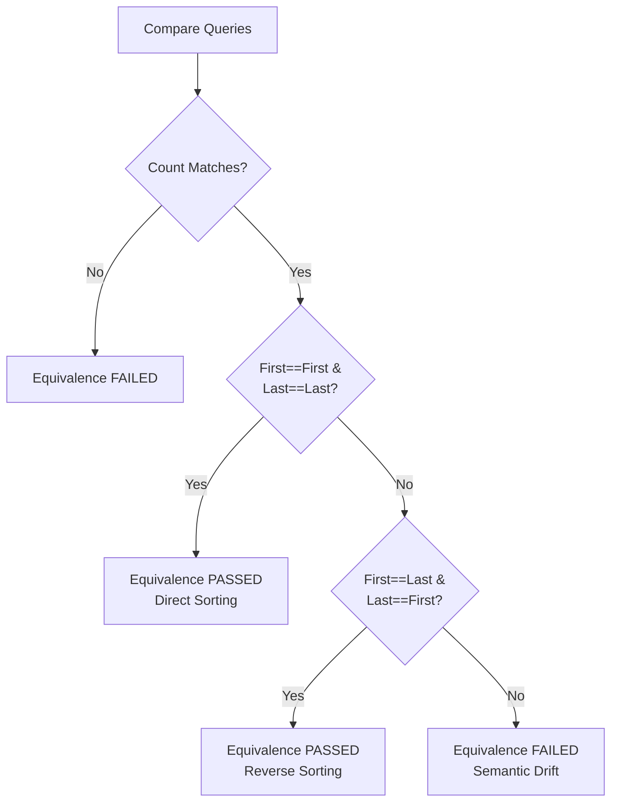

# UOM Orchestrator: Validation Harnesses & Deep Query Equivalence

To guarantee that a translated database schema or query is correct, the UOM Orchestrator does not merely guess or rely on LLM self-reporting. Instead, it compiles the generated target code and runs the resulting queries against actual database sandboxes. 

The orchestrator then extracts the returned datasets and performs a deep differential comparison using specialized, tolerance-enabled verification algorithms.

---

## 1. Sandbox Compilation & Execution Harnesses

The `dotnet_validator.py` and `java_validator.py` custom tools prepare, bundle, and execute code within the Daytona sandboxes.

### 1.1 Base64 Payload Packaging

Transferring source code and project configuration files directly over shell commands introduces severe escaping risks: curly braces, quotation marks, and language-specific escape sequences can break shell interpreters, leading to compilation failures.

To bypass this, the validators package all source files using Base64 encoding:
- The custom `.csproj` or `pom.xml` configuration, the generated validation `Program.cs` or `Program.java`, and the runtime `run.sh` script are Base64 encoded in the Python host.
- The python tool commands the Daytona sandbox shell to decode them safely in-situ:
  ```bash
  echo "aGVsbG8gd29ybGQ=" | base64 -d > "/sandbox/Program.cs"
  ```
- This ensures 100% data integrity, preventing any shell parsing or carriage return corruption across host OS boundaries.

### 1.2 Compilation Assemblies & Commands

Once decoded, the files are compiled using the sandbox’s native framework toolchains:

#### .NET Relational Pipeline
- **Project Structure**: Generates a standard .NET Console Application targeting `net10.0`.
- **Command Sequence**:
  ```bash
  export CONNECTION_STRING="..."
  export EFCORE_RESULTS_PATH="/sandbox/results"
  dotnet build
  dotnet run
  ```
- **Harness Behavior**: The validation harness executes the LINQ/SQL query against the MS SQL Server instance, counts the records, serializes the first and last record samples to JSON, and writes them to the results folder.

#### Java Document/Graph Pipeline
- **Project Structure**: Establishes a standard Maven layout with `pom.xml` configurations for Spring Data.
- **Command Sequence**:
  ```bash
  export MONGODB_URI="..."
  export NEO4J_URI="..."
  mvn -q -B --no-transfer-progress dependency:resolve clean compile
  mvn -q -B --no-transfer-progress exec:java -Dexec.mainClass="uom.services.ValidationEntrypoint"
  ```
- **Harness Behavior**: Maven compiles the Java code silently (`-q -B`), downloads Spring dependencies, and runs the main class to execute the translated Cypher or MongoDB query, dumping record metrics to the results directory.

### 1.3 Reverse-Parsing Shell Output

Maven builds and .NET runs output massive amounts of telemetry (JVM warnings, package restorers, thread diagnostics). To locate the generated JSON files without scanning directory trees:
- The execution scripts print a unique trailing line containing the output file path:
  ```bash
  printf "\nJSON_PATH=%s\n" "$NEWEST_JSON"
  ```
- The validator tool parses the sandbox shell stdout **in reverse order**:
  ```python
  json_path_line = next(
      (line for line in reversed(output.splitlines()) if line.startswith("JSON_PATH=")),
      None
  )
  ```
- This reverse-parsing logic instantly extracts the exact, newly generated results file path, ignoring thousands of lines of preceding compilation logs.

---

## 2. Deep Query Equivalence Verification

Query validation compares relational C# LINQ inputs and Java MongoDB/Neo4j Cypher outputs to confirm semantic correctness. 

### 2.1 Metadata Extraction Shape

To avoid downloading gigabytes of dataset records (which would crash sandbox memory), execution harnesses serialize only high-level metadata statistics representing the output dataset shape:

```json
{
  "Query1": {
    "count": 142,
    "firstSample": {
      "Id": 1001,
      "Name": "Standard Paper Cutter",
      "SupplierID": 5,
      "UnitPrice": 48.50
    },
    "lastSample": {
      "Id": 1143,
      "Name": "Heavy Duty Stapler",
      "SupplierID": 5,
      "UnitPrice": 12.00
    }
  }
}
```

This captures the dataset size (`count`) and the edge boundaries (`firstSample` and `lastSample`), which is sufficient to confirm logical equivalence.

### 2.2 DeepDiff Tolerance Configuration

Simply comparing the JSON structures directly (e.g. `src_json == tgt_json`) fails in practice due to the differences in how databases and ORM serializers operate:
1. **JSON Field Order Variance**: MongoDB document fields might map in a different sequence than SQL Server columnar mappings.
2. **Floating-point Precision Drift**: Relational `Decimal` datatypes represented as `float` in C# can suffer from floating-point precision drift compared to Java's `double` representation of Mongo values (e.g. `48.5000001` vs `48.5`).

To handle these variances, `query_validator.py` configures `DeepDiff` with robust, tolerance-enabled parameters:

```python
diff_first = DeepDiff(
    src_first, 
    tgt_first, 
    ignore_order=True, 
    report_repetition=True, 
    significant_digits=3, 
    cutoff_intersection_for_pairs=1, 
    cutoff_distance_for_pairs=1, 
    get_deep_distance=True
)
```

- `ignore_order=True`: Bypasses sequence discrepancies of keys or lists, focusing strictly on item values.
- `significant_digits=3`: Automatically rounds floating-point values to three decimal places before comparing, eliminating precision-drift false failures.

### 2.3 The Swapped Sorting Robustness Algorithm

A common source of false-negatives in ORM migrations is sorting order. Relational servers might default to sorted clustered keys, while MongoDB or Neo4j drivers default to insertion sequence or natural indexing, reversing or swapping the output order of samples.

If the count matches but direct first-to-first or last-to-last comparisons show differences, the system invokes the **Reverse Sorting Robustness Check**:



If the swapped comparison returns a `deep_distance` of 0, the query translation is accepted as semantically equivalent, successfully resolving a major false-rejection edge case.

### 2.4 Event-Loop Thread Delegation

Calculating DeepDiff metrics over large document trees is highly CPU-bound. If executed directly inside Python's single-threaded async event loop, it will block all incoming HTTP server traffic and freeze the LangGraph state machine.

To prevent this, the equivalence checker delegates the diff computations to a worker thread pool using `asyncio.to_thread`:

```python
diff_tasks[key] = asyncio.to_thread(compute_diffs)
...
awaited_tasks = await asyncio.gather(*diff_tasks.values(), return_exceptions=True)
```

This offloads CPU-heavy operations to background threads, keeping the orchestrator async event loop completely unblocked and highly responsive.
