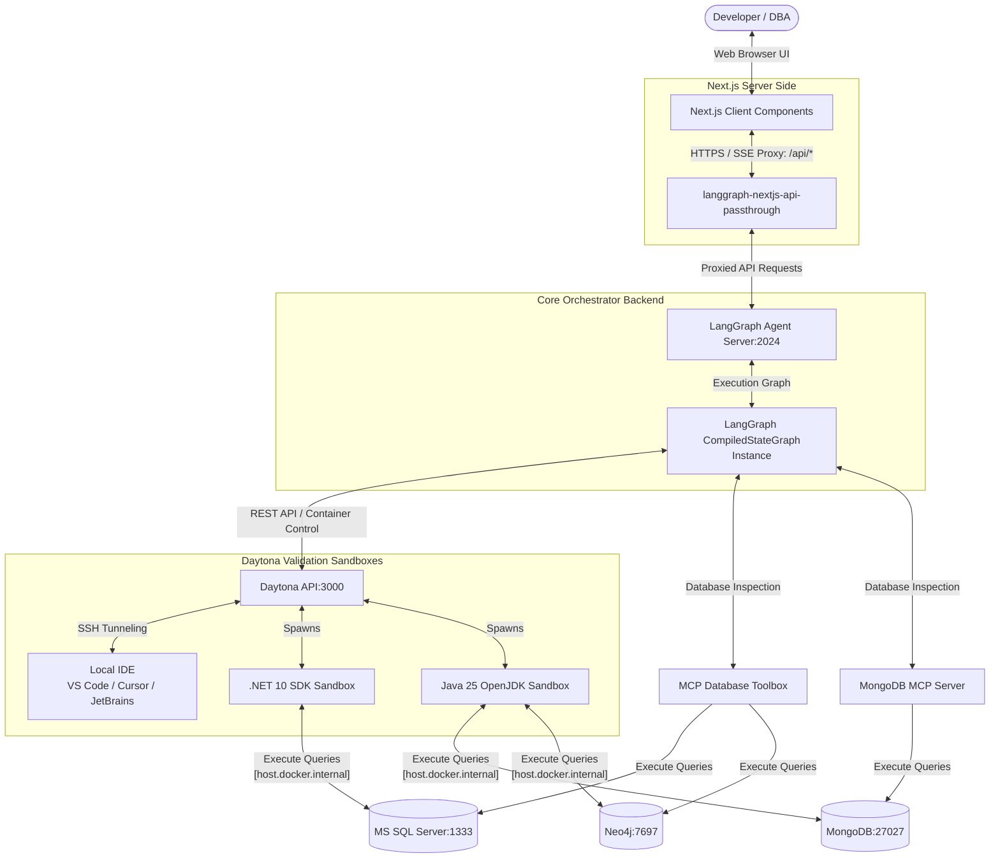

# UOM Assistant Frontend: System Architecture & Routing Design

This document provides a detailed technical breakdown of the architecture, routing layers, security proxy mechanisms, and state propagation flow implemented in the **Universal Object Mapping (UOM)Assistant** frontend dashboard.

---

## 1. System Topology & Communication Interfaces

The UOM frontend acts as a responsive, real-time control plane. It interfaces between the user, the LangGraph orchestrator service, the MCP database schema checkers, and the isolated Daytona sandbox execution environments.



### 1.1 Client-Server Boundaries
*   **Next.js Frontend (`localhost:3001`)**: Executed as a Node.js Server providing SSR, Proxy, App Router, Server Functions, etc., bundling assets for the Client's browser (most of the `assistant-ui` components run in the browser). It runs the UI layout, holds temporary config values, manages active thread context, and renders stream output.
*   **Next.js API Passthrough Proxy**: Executed on the Next.js server node. It routes requests, injects credentials, and shields sensitive downstream APIs from client visibility.
*   **LangGraph Agent Server (`localhost:2024`)**: Orchestrates the translation steps, runs agent iterations, manages the thread history database (using Postgres and Redis checkpointers), and coordinates with the compilation sandboxes.

---

## 2. Core Libraries

*  **Assistant-UI**: The frontend uses the `assistant-ui` library for core chat thread components, message rendering, and the composer input. Custom wrappers and extensions are implemented to integrate with the LangGraph runtime and support the specific translation pipeline steps.
*  **LangGraph SDK**: The frontend uses the `@langchain/langgraph-sdk` client to communicate with the Next.js API proxy routes, which then forward requests to the LangGraph backend server.
*  **Shadcn UI & Radix UI & Tailwind CSS**: The UI styling is built on top of [Shadcn UI](https://ui.shadcn.com/) components, [Radix headless primitives](https://www.radix-ui.com/primitives/docs/overview/introduction), and [Tailwind CSS](https://tailwindcss.com/) utilities.

---

## 3. Next.js API Passthrough Routing & Security

To prevent sensitive API keys and system URLs (such as LangSmith project keys, Daytona tokens, or Metacentrum e-INFRA cluster credentials) from leaking to the client browser, the frontend implements a server-side routing proxy.

### 3.1 Proxy Implementation & File Mappings
The UOM Translator UI (`frontend/uom-translator-ui`) specialized proxy to route client-server requests to LangGraph Agent Server utilizing the standard Node.js server environment to allow full filesystem mapping and larger buffer transfers:

*   **File Path**: [`frontend/uom-translator-ui/app/api/[..._path]/route.ts`](../../frontend/uom-translator-ui/app/api/%5B..._path%5D/route.ts)
*   **Runtime**: `nodejs`
*   **Code Implementation**:
    ```typescript
    import { initApiPassthrough } from "langgraph-nextjs-api-passthrough";
    
    export const { GET, POST, PUT, PATCH, DELETE, OPTIONS, runtime } =
    	initApiPassthrough({
    		apiUrl: process.env.LANGGRAPH_API_URL,   // E.g., http://localhost:2024
    		apiKey: process.env.LANGSMITH_API_KEY,   // Injected securely on the server
    		runtime: "nodejs",
    	});
    ```

### 3.2 Routing Mechanics
When the frontend SDK initiates thread searches, fetches state checkpoints, or sends stream runs, it directs requests to the browser-accessible endpoint `/api/threads` or `/api/runs`. The Next.js server intercepts these routes, appends authorization headers (`x-api-key`), and proxies the payload to the internal LangGraph server URL (`LANGGRAPH_API_URL`). This setup shields backend APIs from public inspection.

---

## 4. Client-Side SDK Initialization

The frontend utilizes the `@langchain/langgraph-sdk` client to communicate with the Next.js API proxy routes.

*   **File Path**: [`frontend/uom-translator-ui/lib/chatApi.ts`](../../frontend/uom-translator-ui/lib/chatApi.ts)

### 4.1 Client Factory Implementation
To ensure the SDK client routes through the server proxy rather than trying to hit internal backend networks directly, the client is initialized using a dynamic resolution factory:
```typescript
import { Client } from "@langchain/langgraph-sdk";

export const createClient = () => {
	const apiUrl =
		process.env.NEXT_PUBLIC_LANGGRAPH_API_URL ||
		(typeof window !== "undefined"
			? new URL("/api", window.location.href).href
			: "/api");
	return new Client({ apiUrl });
};
```
*   **Browser/Server Resolution**: If `NEXT_PUBLIC_LANGGRAPH_API_URL` is not provided, the factory checks if it is running in the client browser (`typeof window !== "undefined"`). If so, it computes the absolute URL based on the current window host (resolving to `/api`), directing calls through the proxy route.

---

## 5. Context & State Propagation Flow

State distribution across the translation workspace is managed through a central React Context layer, ensuring synchronization between the server-side environment variables, conversational stream and UI components (like the IDE Link Component, Alert error logs, or Toast notifications).

*   **File Path**: [`frontend/uom-translator-ui/hooks/use-graph-state-context.ts`](../../frontend/uom-translator-ui/hooks/use-graph-state-context.ts)

*   **File Path**: [`frontend/uom-translator-ui/hooks/use-app-context.ts`](../../frontend/uom-translator-ui/hooks/use-graph-state-context.ts)

### 5.1 State Context Type Signatures
The React Context exposes variables to monitor active nodes and capture compilation failures:
```typescript
export interface GraphStateContextType {
	graphState: Partial<BackendState>;
	error: { message: string; error?: any } | null;
	setError: (error: { message: string; error?: any } | null) => void;
	runError: { message: string; error?: any } | null;
	setRunError: (error: { message: string; error?: any } | null) => void;
	activeNode: keyof typeof NODE_NAME_MAP | null;
}

export interface AppContext {
	defaultUomGraphContext: Partial<UOMGraphContext>;
}
```

---

## 6. UI Style Resolution & Tailwind Integrations

The UOM Assistant uses a styled component layer built on top of [Shadcn UI](https://ui.shadcn.com/) and [Tailwind CSS](https://tailwindcss.com/) utilities and custom stylesheets.

*   **File Path**: [`frontend/uom-translator-ui/lib/utils.ts`](../../frontend/uom-translator-ui/lib/utils.ts)

To avoid conflicts during dynamic CSS class injection (e.g., merging layout alignments or padding overrides inside message components), the application routes styles through a class merger:
```typescript
import { type ClassValue, clsx } from "clsx";
import { twMerge } from "tailwind-merge";

export function cn(...inputs: ClassValue[]) {
	return twMerge(clsx(inputs));
}
```
*   **Resolution Process**: `clsx` resolves conditional arrays, key-value classes, and nested string inputs into a unified class string. `twMerge` then parses the Tailwind classes and overrides redundant or conflicting properties, ensuring the last declared style takes precedence.
