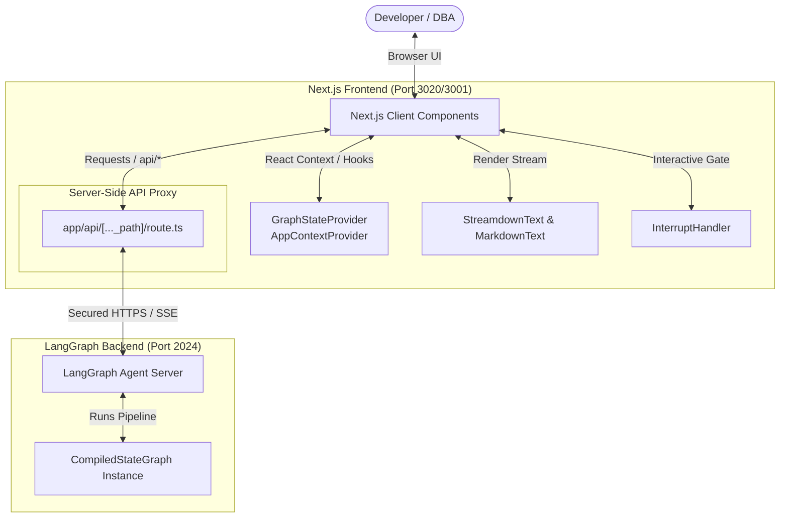

# Universal Object Mapping (UOM) Assistant Frontend Overview

Welcome to the comprehensive system overview for the **Universal Object Mapping (UOM) Assistant** frontend dashboard (internally named `uom-translator-ui`). 

The UOM Assistant is a web chatbot-like dashboard and interactive AI advisor designed to guide software developers, database administrators (DBAs), and system architects through the complex lifecycle of cross-paradigm schema and query migrations. In modern data-intensive systems, shifting a software stack from a relational database schema to an optimized NoSQL paradigm (document or graph) is highly error-prone. The UOM frontend solves this by providing a unified workspace that coordinates relational SQL inspections, LLM-based query translations, Daytona container-based builds, and real-time execution telemetry.

---

## 1. Target Audience & System Purpose

The UOM Assistant targets two primary personas:
*   **Database Administrators (DBAs)**: Who require high-fidelity insights into schema mapping decisions, database inspection status (via Model Context Protocol - MCP), and semantic data equivalence audits.
*   **Software Engineers**: Who need to translate database access code (e.g., C# Entity Framework Core, Dapper SQL, or NHibernate) to equivalent target structures (e.g., Java Spring Data MongoDB or Spring Data Neo4j) and require immediate access to isolated compilation environments for troubleshooting.

---

## 2. Core Capabilities

### 2.1 AI-Driven Interactive Workspace (`assistant-ui`)
The interface leverages the modern [`assistant-ui`](https://github.com/assistant-ui/assistant-ui) library with pre-built [LangGraph runtime template](https://github.com/assistant-ui/assistant-ui/tree/main/examples/with-langgraph) (using their [Quickstart tutorial](https://www.assistant-ui.com/docs/runtimes/langgraph/quickstart)) to deliver a conversational agent environment optimized for technical workflows. Rather than treating chat as a generic text bubble interface, the UOM dashboard maps the components of the assistant:
*   **Structured Prompt Suggestions**: Pre-baked onboarding templates for translating NHibernate to MongoDB, Dapper to Spring Data MongoDB, and EF Core to MongoDB/Neo4j.
*   **Collapsible Thinking Accordions**: Renders the raw reasoning path of the underlying LLM (e.g., `einfra/kimi-k2.6` or `einfra/deepseek-v4-pro-thinking`), keeping the chat clean while preserving diagnostic depth.
*   **MCP Tool Call Integration**: Displays the invocation parameters and execution status of external database tools, letting engineers see exactly what tables are being analyzed.

### 2.2 Live Code Compilation and Deep-Linking (Daytona)
During the translation phase, the backend provisions containerized sandbox compilation units using Daytona. The frontend:
*   Queries the container gateway to retrieve active build context metadata.
*   Provisions temporary SSH authorization tokens.
*   Generates deep-link URIs to connect local developer workstations (`vscode://`, or `cursor://`) directly to the active compilation sandbox.

### 2.3 Streaming JSON Parsers & Scroll Locking
Rather than waiting for the agent to finish generating large multi-kilobyte JSON state updates or compilation reports:
*   An on-the-fly streaming parser (`partial-json`) decodes incoming JSON chunks starting with `{` inside code blocks.
*   The results are rendered as an interactive tree structure using `@uiw/react-json-view`.
*   A scroll-locking viewport algorithm (MutationObserver) automatically tracks the active generation position, allowing manual override if the user scrolls up past a 15px scroll threshold.

### 2.4 Suspended Verification Gates (Human-in-the-Loop)
If the translation engine fails compilation checks or semantic equivalence tests repeatedly (exceeding 3 automatic retries), the LangGraph execution suspends. The frontend displays an interactive gate card presenting:
*   Verifier stdout/stderr compilation logs.
*   Structural differences between relational results and NoSQL outputs (`DeepDiff` reports).
*   Options to **Accept** the current translation draft or **Reject & Correct** it by typing manual pointer adjustments.

---

## 3. Frontend Architecture Context Diagram

The following diagram illustrates how the frontend components coordinate user interactions, proxy routing, and the LangGraph orchestrator:

---

## 4. Frontend Workspace Layout & Directory Map

To help developers contribute to the frontend codebase, the layout of the source files is structured as follows:

*   **[`app/`](../../frontend/uom-translator-ui/app)**: Next.js App Router directories. Contains the root layout, global stylesheet loading, and the API passthrough proxy routes.
    *   **[`app/api/[..._path]/route.ts`](../../frontend/uom-translator-ui/app/api/%5B..._path%5D/route.ts)**: Node.js server route that proxies LangGraph calls.
*   **[`components/`](../../frontend/uom-translator-ui/components)**: Reusable UI components.
    *   **[`components/assistant-ui/`](../../frontend/uom-translator-ui/components/assistant-ui)**: Custom implementation of the `assistant-ui` components (thread, message, composer, reasoning drawer, and interrupt gate).
    *   **[`components/config-modal.tsx`](../../frontend/uom-translator-ui/components/config-modal.tsx)**: Onboarding modal for database connection strings and LLM endpoints.
    *   **[`components/ide-link.tsx`](../../frontend/uom-translator-ui/components/ide-link.tsx)**: Daytona container Deep-Linking trigger.
    *   **[`components/json-viewer.tsx`](../../frontend/uom-translator-ui/components/json-viewer.tsx)**: Auto-scrolling JSON tree rendering component.
*   **[`hooks/`](../../frontend/uom-translator-ui/hooks)**: Context providers and hooks.
    *   **[`hooks/use-graph-state-context.ts`](../../frontend/uom-translator-ui/hooks/use-graph-state-context.ts)**: Context hook distributing active node execution variables.
    *   **[`hooks/use-app-context.ts`](../../frontend/uom-translator-ui/hooks/use-app-context.ts)**: Context hook distributing global app state (e.g. default config from environment variables).
*   **[`lib/`](../../frontend/uom-translator-ui/lib)**: Type contracts and client factories.
    *   **[`lib/chatApi.ts`](../../frontend/uom-translator-ui/lib/chatApi.ts)**: LangGraph SDK client initialization factory.
