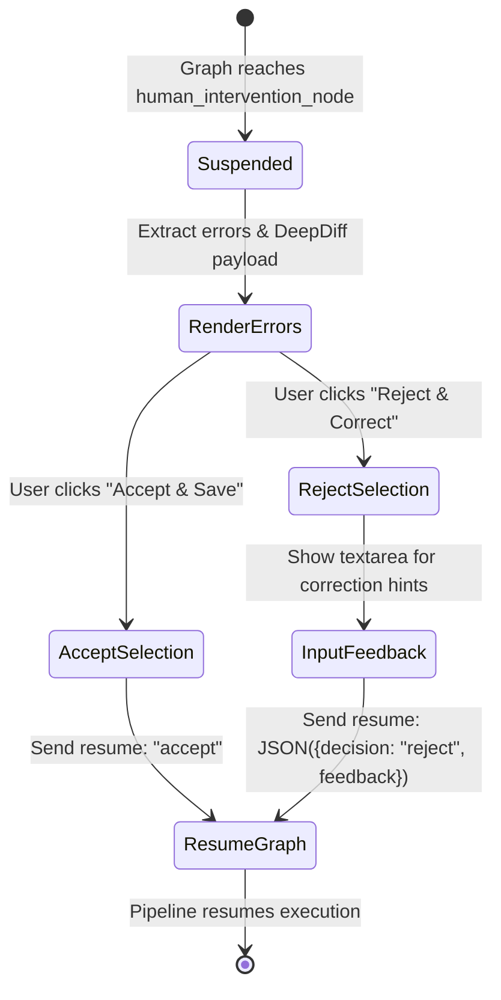

# UOM Assistant Frontend: State Synchronization & LangGraph Runtime

This document explains the runtime state machine integration, event stream adapters, checkpoint backtracking logic, and manual checkpoint recovery routines utilized in the **UOM Assistant** frontend dashboard.

---

## 1. The Runtime Wrapper & Local State Machine

The interface communicates with the LangGraph backend via the `useLangGraphRuntime` hook, which is wrapped in a provider component to distribute state across the workspace:

*   **File Path**: [`frontend/uom-translator-ui/components/assistant-ui/runtime/assistant-runtime-provider.tsx`](../../frontend/uom-translator-ui/components/assistant-ui/runtime/assistant-runtime-provider.tsx)
*   **Component**: `AssistantRuntimeProviderWrapper`

The wrapper maintains the local reactive state machine:
*   `graphState`: A `Partial<BackendState>` containing the active translation data, validation errors, and equivalence diff logs.
*   `error` and `runError`: Diagnostic models logging compilation failures and stream aborted triggers.
*   `activeNode`: Identifies the current executing python node in the backend (e.g., input extraction, schema inspection, compilation validation, equivalence checks, and evaluations).

---

## 2. Configurable Context Injection (`stream`)

When a user submits a query via the Composer input, the custom `stream` callback triggers. This method loads credentials and database configuration settings from `localStorage` under the `"uom_translator_config"` key and injects them as a structured payload into the run execution context. For more information on LanGraph SDK client methods/options (streamMode, streamSubgraphs, context), see the [LangGraph SDK documentation](https://reference.langchain.com/javascript/langchain-langgraph-sdk).

```typescript
const savedConfig = typeof window !== "undefined" ? localStorage.getItem("uom_translator_config") : null;
const configurable: UomConfig = savedConfig ? JSON.parse(savedConfig) : {};

const payload = {
    input: messages.length ? { messages } : null,
    streamMode: ["messages-tuple", "values", "custom"],
    streamSubgraphs: true,
    ...(config.abortSignal != null && { signal: config.abortSignal }),
    onDisconnect: "cancel",
    multitaskStrategy: "reject",
    ...(config.command != null && { command: config.command }),
    ...(config.checkpointId != null && {
        checkpoint: { checkpoint_id: config.checkpointId },
    }),
    context: {
        ollama_host: configurable.ollamaHost || undefined,
        openai_api_url: configurable.openaiApiUrl || undefined,
        openai_api_key: configurable.openaiApiKey || undefined,
        model: configurable.model || undefined,
        db_toolbox_uri: configurable.dbToolboxUri || undefined,
        mongodb_mcp_uri: configurable.mongodbMcpUri || undefined,
        ms_sql_connection_string: configurable.mssqlConnectionString || undefined,
        mongodb_uri: configurable.mongodbUri || undefined,
        neo4j_uri: configurable.neo4jUri || undefined,
        neo4j_password: configurable.neo4jPassword || undefined,
        daytona_api_url: configurable.daytonaApiUrl || undefined,
        daytona_api_key: configurable.daytonaApiKey || undefined,
        daytona_target: configurable.daytonaTarget || undefined,
        sandbox_execution_timeout: configurable.daytonaTimeout || undefined,
    },
};

const eventStream = await client.runs.stream(externalId, ASSISTANT_ID, payload);
```

Some payload parameters, come directly from `assistant-ui` runtime, which are passed through the `config` argument of the `stream` method:
*   `abortSignal`: An `AbortController` signal that can be triggered to cancel the stream.
*   `command`: An optional string command, use for example in the `InterruptHandler` component to send resume commands back to the LangGraph.
*   `checkpointId`: An optional string identifier for resuming from a specific checkpoint in the thread history.

### 2.1 LLM Backend Switcher
This injection logic allows users to swap models and providers on-the-fly:
*   **Local Ollama Deployment**: Directs requests to a local daemon (e.g., `http://localhost:11434`) running open-weights models like `qwen2.5-coder`.
*   **Remote Metacentrum e-INFRA CZ**: Routes calls through Metacentrum's OpenAI-compatible APIs, providing access to larger models like `einfra/kimi-k2.6` or `einfra/deepseek-v4-pro-thinking`.

---

## 3. Sub-graphs, Event Handlers, & Custom Telemetry

The runtime adapter processes LangGraph events to sync backend execution details with the UI.

### 3.1 Sub-graph State Merging
To track execution parameters inside nested validation or equivalence test subgraphs, the runtime processes sub-graph values and merges them into the main state object. See [LangGraph Subgraph Docs](https://docs.langchain.com/oss/python/langgraph/use-subgraphs) how multi-agent orchestration works.
```typescript
onSubgraphValues: (namespace: string, values: any) => {
    if (values) {
        setGraphState((prev) => ({ ...prev, ...values }));
    }
}
```

### 3.2 Custom Event Logs (`onCustomEvent`)
The Python orchestrator streams container log details and validation updates as custom events, which are processed by the runtime for debugging:
```typescript
onCustomEvent: (type: string, data: any) => {
    console.log(`[UOM] Custom event [${type}]:`, data);
}
```

### 3.3 Noise Reduction Error Filtering
To prevent system warnings or connection resets from flooding the user console, the error handler implements a filtering system that ignores known harmless messages:
```typescript
const EXCLUDED_ERRORS = ["signal is aborted without reason"];

const handleError = (msg: string, error?: any) => {
    if (EXCLUDED_ERRORS.includes(error?.message)) {
        console.warn("Excluded error occurred:", error);
        return;
    }
    console.error(`[UOM Error] ${msg}:`, error);
};
```

---

## 5. Thread List Synchronization (`RemoteThreadListAdapter`)

*Note: The adapter definitions in this section are simplified conceptual representations of the actual implementation.*

The frontend maps UI actions (like creating or deleting threads) to the backend database using a thread list adapter:

### 5.1 Adapter Methods
*   **`list()`**: Queries the thread catalog using `client.threads.search` (returning up to 50 threads sorted by creation date descending):
    ```typescript
    list: async () => {
        return await client.threads.search({ limit: 50 });
    }
    ```
*   **`rename(remoteId, newTitle)`**: Updates metadata tags stored on the server:
    ```typescript
    rename: async (remoteId, newTitle) => {
        await client.threads.update(remoteId, { metadata: { title: newTitle } });
    }
    ```
*   **`delete(remoteId)`**: Removes the thread from server persistence:
    ```typescript
    delete: async (remoteId) => {
        await client.threads.delete(remoteId);
    }
    ```
*   **`initialize()`**: Provisions a new thread identifier on the server, initialized with a timestamped title:
    ```typescript
    initialize: async () => {
        const title = `Migration ${new Date().toISOString()}`;
        return await client.threads.create({ metadata: { title } });
    }
    ```
*   **`fetch(threadId)`**: Retrieves the current state and messages for the selected thread:
    ```typescript
    fetch: async (threadId) => {
        return await client.threads.get(threadId);
    }
    ```

---

## 6. Interrupt & User Decision Flow (`InterruptHandler`)

*   **File Path**: [`frontend/uom-translator-ui/components/assistant-ui/interrupt-handler.tsx`](../../frontend/uom-translator-ui/components/assistant-ui/interrupt-handler.tsx)
*   **Component**: `InterruptHandler`

When the orchestrator reaches a manual validation gate, it suspends execution and returns validation errors and query equivalence reports. The `InterruptHandler` renders these details to the user and displays action buttons.

### 6.1 State Transitions during Suspends


The component uses hooks from `@assistant-ui/react-langgraph` to resume the graph:
*   `useLangGraphInterruptState()`: Accesses the active suspend payload, checking if `resumable` is true.
*   `useLangGraphSendCommand()`: Resumes execution by posting a control decision payload back to the LangGraph node:
    *   **Accept**: Sends `{ resume: "accept" }`, directing the orchestrator to skip validation and proceed.
    *   **Reject & Correct**: Opens a text area for correction instructions, sending a JSON payload containing the user's feedback to guide the next generation loop:
        ```typescript
        const resume = JSON.stringify({ decision: "reject", feedback });
        await sendCommand({ resume });
        ```

For more information on interrupt handling and human-in-the-loop patterns, see the [LangGraph Interrupts Documentation](https://docs.langchain.com/oss/python/langgraph/interrupts).
