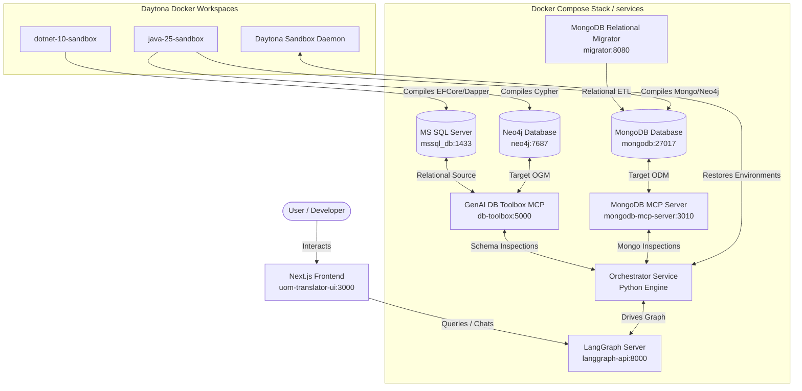

<h1 align="center">Universal Object Mapping (UOM)</h1>

**Universal Object Mapping (UOM)** is an advanced research and engineering platform designed to automate the translation, validation, and performance optimization of database schemas and query code across diverse Object-Relational Mapping (ORM), Object-Document Mapping (ODM), and Object-Graph Mapping (OGM) paradigms. 

Developed within the **Adaptive Data Management (ADaM) Research Group** at the Department of Software Engineering, Charles University (Faculty of Mathematics and Physics), the project addresses the complex challenges of multi-model database migrations. UOM transitions relational .NET ORM structures (.NET Entity Framework Core, Dapper, NHibernate) into document and graph-based Java Spring Data ecosystems (Spring Data MongoDB, Spring Data Neo4j) with structural compile-and-execute guarantees.


---

## 1. Project Background & Pedigree (ORMorpher)

UOM builds directly upon **ORMorpher** (originally developed by Milan Abrahám as part of his Master's thesis, and later published in the *IEEE/ACM International Conference on Automated Software Engineering - ASE 2025*). 

*   **Legacy Rule Engine**: ORMorpher established C# compiler-based heuristics using the Roslyn Scripting API to map SQL/LINQ queries to an Abstract Representation. It then used **Integer Linear Programming (ILP)** to dynamically benchmark and select optimal .NET frameworks based on runtime constraints.
*   **The LLM Advisor Extension**: The UOM project extends this foundation by introducing an autonomous **LLM Advisor** to handle cross-paradigm schema and query transitions (Relational C# to Document/Graph Java). Rather than relying on rigid, hardcoded rules that struggle with heterogeneous schema mapping (like embedding tables vs. document nesting), UOM deploys an iterative, stateful [LangGraph](https://www.langchain.com/langgraph) translation machine.

---

## 2. Platform Architecture & Data Flow

The complete UOM system coordinates containerized database engines, schema adapters, a Next.js user interface, and isolated Daytona compilation sandboxes:



### 2.1 Component Matrix

*   **Frontend User Interface ([frontend/uom-translator-ui](frontend/uom-translator-ui))**: A modern Next.js App Router client utilizing [assistant-ui](https://github.com/assistant-ui/assistant-ui) library components. Styled with [TailwindCSS](https://tailwindcss.com/) and [Shadcn/UI](https://ui.shadcn.com/), it streams compilation diagnostic logs and [DeepDiff](https://zepworks.com/deepdiff/current/index.html) result comparisons back to the user in real time.
*   **LLM Orchestrator ([services/orchestrator](services/orchestrator))**: A Python-based service running a stateful [LangGraph](https://github.com/langchain-ai/langgraph) execution graph. Details of its state definitions, compiler nodes, and thread parameters are documented in the **[Orchestrator README](services/orchestrator/README.md)**.
*   **Validation Sandboxes**: Ephemeral environment containers (.NET 10 SDK and Java OpenJDK 25) managed via [Daytona](https://github.com/daytonaio/daytona) to compile and execute generated code without risk to the host filesystem.
*   **Relational Source Database**: A Microsoft SQL Server instance (`mssql_db`) pre-loaded with the **WideWorldImporters** sample dataset.

---

## 3. Semi-Automatic ETL & Data Migration Pipelines

To validate query translations against real-world datasets, the target document (MongoDB) and graph (Neo4j) database engines must contain matching, logically equivalent data models. UOM defines a **one-time, semi-automatic ETL process** to map and migrate relational schemas:

1.  **Relational-to-Document Migration (MongoDB)**:
    *   Configured using [MongoDB Relational Migrator](https://www.mongodb.com/docs/relational-migrator/getting-started/) (web dashboard at `http://localhost:8091`).
    *   Users define how SQL columnar tables and primary/foreign key relationships map into MongoDB document collections, specifying document embedding patterns (e.g. embedding order items within parent orders) vs. referencing models.
    *   The migrator connects via JDBC and executes the ETL pipelines, populating the `uom` database in MongoDB.
2.  **Relational-to-Graph Migration (Neo4j)**:
    *   Configured using the [**Neo4j ETL Tool**](https://neo4j.com/labs/etl-tool/) and APOC plugins OR via the [Neo4j ETL CLI](https://neo4j.com/labs/etl-tool/1.5.0/neo4j-etl/) for more control and to bypass UI issues. (NOTE: Neo4j ETL Tool UI is only available in [Neo4j Desktop v1.6](https://neo4j.com/docs/desktop/1.6/) and older)
    *   Maps relational tables to graph nodes, and foreign-key joins to node relationship labels (e.g. `(:Order)-[:CONTAINS]->(:Product)`).
    *   Populates the graph database, providing equivalent dataset structures prior to Cypher validation.

JDBC connection configurations are mapped inside the [services/etl](services/etl) directory.

---

## 4. Development Requirements

To run, compile, or debug the monorepo, your host environment must satisfy the following development requirements:

*   **Docker Environment**: Docker Engine 25+ with Docker Compose V2 support (to run relational/NoSQL backends, MCP adapters, and Next.js).
*   **Python Tooling**: Python 3.11+ (better 3.13, cause 3.14+ already causes issues) managed via [uv](https://astral.sh/uv/) for high-speed workspace synchronization.
*   **OS**: Linux or Windows Subsystem for Linux (WSL) recommended for optimal Docker performance and filesystem compatibility with Daytona sandboxes.
*   **Node.js Environment**: Node.js v24 managed via `pnpm` workspaces (for Next.js App Router).
*   **Daytona Toolchain**: Daytona server daemon active locally to manage isolated SDK container sandboxes.
*   **LLM Providers**: Access to high-quality LLMs via Metacentrum [e-INFRA CZ](https://docs.cerit.io/en/docs/ai-as-a-service/introduction) OpenAI-compatible vLLM endpoints (e.g. Kimi K2.6, GLM-5), any Open-AI compatible API with a comparable LLM model, or a running local instance of [Ollama](https://ollama.com/) (e.g. qwen-3.6, qwen3-coder-next).

---

## 5. Development Quick Start & Execution

Follow these step-by-step instructions to boot the complete monorepo stack:

### Step 1: Configure Environment Variables
Copy the env templates in the [workspace root directory](.env.example), [frontend/uom-translator-ui](frontend/uom-translator-ui/.env.example), and [services/orchestrator](services/orchestrator/.env.example), and fill in your LLM provider keys, base URLs, and any other necessary parameters:
```bash
cp .env.example .env.dev # for development
cp .env.example .env # for production
cp .env.example .env.development # for development in frontend Next.js project
cp .env.example .env.production # for production in frontend Next.js project
```

### Step 2: Spin Up the Container Stack
Boot the databases, MCP adapters, relational migrator, Daytona stack, and/or Langgraph orchestrator backend in the background:
```bash
./scripts/init-project.sh
```
Ensure all healthchecks pass. If errors occur, reset with `./scripts/destroy-containers.sh`, fix the issues, and try again.

### Step 3: Configure the Databases (ETL)

#### MongoDB
Access the MongoDB Relational Migrator dashboard at [http://localhost:8091](http://localhost:8091), connect to the Microsoft SQL Server source, and configure the relational-to-document mapping to migrate the `WideWorldImporters` dataset into MongoDB. Pre-configured mappings/settings have been prepared in the [`services/etl/mongodb/UOM WideWorldImporters`](services/etl/mongodb/UOM%20WideWorldImporters.relmig) file for reference (import the project file in UI). For simpler execution, run the provided migration script:
```bash
./services/etl/mongodb/run_mongodb_etl.sh
```

#### Neo4j
For Neo4j, use the Neo4j ETL Tool UI to connect to Microsoft SQL Server and execute the relational-to-graph migration. This approach may result in errors, since Neo4j ETL Tool UI hasn't been updated in a while: in that case, extract the generated mapping file and follow the CLI approach below.
```bash
./services/etl/neo4j/run-neo4j-etl.sh
```

### Step 4: Create Daytona API Key
To allow the Orchestrator to interact with the Daytona server, an API key must be generated and added to the environment variables.

1. Go to [http://localhost:3000](http://localhost:3000) to access the Daytona dashboard. You'll be asked to authenticate. Use the default credentials:
   * Username: `dev@daytona.io`
   * Password: `password`
2. Once logged in, navigate to the "API Keys" section on the left and create a new API key with "Create Key". Name it `default`, and make sure the "Permissions" is set to `Full Access`. 
3. Copy the generated key and update the `DAYTONA_API_KEY` variable in both `.env.dev` and `.env` files in the `services/orchestrator` directory.
4. Rebuild the orchestrator service/server after updating the API key.

For more information, see [Daytona Docs](https://www.daytona.io/docs/), specifically the [Daytona API Keys](https://www.daytona.io/docs/en/api-keys/) section.

### Step 5: Start the LangGraph Server
Open a separate terminal window, sync the python dependencies, and boot the LangGraph development server:
```bash
cd services/orchestrator
direnv allow # if you have direnv installed, otherwise ensure the environment variables are loaded
uv sync --all-extras && ./scripts/load_env.sh && ./scripts/init_daytona_snapshots.sh # or better `make dev` if you have Make (recommended), otherwise check the scripts in Makefile
langgraph dev --allow-blocking # or better `make dev`
```
The server will start listening on [http://localhost:2024](http://localhost:2024). The LangSmith Agent Studio web dashboard should be automatically opened.

For development, LLM request mocking is recommended to avoid hitting rate limits and speed up iterations. To enable LLM response mocking, run:
```bash
make record_requests
```
This will record all LLM requests and responses to a local fixtures directory. Set the `.env.dev` endpoint accordingly.

### Step 6: Launch the Next.js Frontend
Open a third terminal, download the dependencies, and start the Next.js frontend:
```bash
cd frontend/uom-translator-ui
pnpm install
pnpm dev:frontend
```
Open your web browser to **[http://localhost:3001](http://localhost:3001)** (since Daytona API is already running at [http://localhost:3000](http://localhost:3000)) to access the UOM Assistant UI frontend and begin translating query code!

## 6. Production Deployment
To deploy the stack in production mode, ensure all environment variables in the `.env` files are properly configured (domain names, IP addresses, mostly networking-related), and run:
```bash
./scripts/init-project-prod.sh
```
See the **[DevOps & Deployment Operations](docs/devops/devops.md)** documentation for detailed information on the production deployment setup, environment variable configurations, and operational guidelines.

---

## 6. Subsystem Documentation Index

Review the following modular documentation files for detailed, verbose analyses of UOM's backend orchestrator, Next.js frontend, and DevOps pipelines:

### 6.1 UOM Orchestrator Backend Subsystem
*   **[System Architecture Diagram & LangGraph Nodes](docs/backend/architecture.md)**: Details graph logic, node transitions, and ReAct agent deprecations.
*   **[State Representation & Message Isolation](docs/backend/state_and_context.md)**: Explains the `translation_messages` isolation layer and Context reflection.
*   **[Daytona Sandbox Managers](docs/backend/sandbox_environment.md)**: Details baseline snapshot builds, exponential backoffs, and log streams.
*   **[Semantic Equivalence Algorithms](docs/backend/validators_and_equivalence.md)**: Reviews Base64 encoding, Maven executions, DeepDiff, and swapped sorting orders check logic.
*   **[DeepAgent & ACP Interfaces](docs/backend/deep_agent_and_acp.md)**: Analyzes ACP session modes, local context inspection bash scripts, and CompositeBackend routing.
*   **[MCP Adapters & Toolbox Tools](docs/backend/mcp_integration.md)**: Details SSE connections, MongoDB HTTP clients, and database safety fallback parameters.

### 6.2 UOM Advisor Frontend Dashboard
*   **[Frontend System Overview](docs/frontend/overview.md)**: Introduces the translation workspace features, suggestion engines, and workspace layout.
*   **[Frontend Architecture & Proxy Routing](docs/frontend/architecture.md)**: Explains the API passthrough proxy, client-side SDK clients, state propagation context, and style utilities.
*   **[Frontend Runtime & Integration](docs/frontend/runtime.md)**: Details configuration injection, sub-graph events, thread list synchronization adapters, and checkpoint tracking.
*   **[Frontend UI Component Specifications](docs/frontend/components.md)**: Exhaustive details on Settings onboarding, Daytona remote IDE links, auto-scroll JSON visualizers, and streamdown markdown parsers.
*   **[Frontend Setup & Contribution Guidelines](docs/frontend/setup.md)**: Details dev requirements, production multi-stage Docker builds, and Biome coding standards.
*   **[User & Operator Guide](docs/frontend/user_guide.md)**: Explains how to start translation sessions, configure targets, diagnose build errors, and handle suspended human-in-the-loop checkpoints.

### 6.3 DevOps & Deployment Operations
*   **[DevOps Setup, Deployment & Operations](docs/devops/devops.md)**: Exhaustive details on Docker Compose profiles, environment setups, sandbox timeouts, init/destroy scripts, and database initialization pipelines.

---

## Acknowledgements

Part of the `benchmarks` source code, including some workflows and diagrams, were developed by Milan Abrahám as part of his Master thesis titled _Framework-Agnostic Query Adaptation: Ensuring SQL Compatibility Across .NET Database Frameworks_. The thesis is available at http://hdl.handle.net/20.500.11956/203083, and the source code is available at https://github.com/milan252525/orm-convertor.
