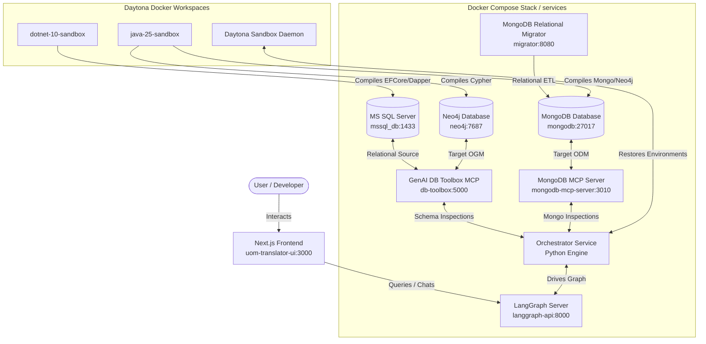

**Universal Object Mapping (UOM)** is an advanced research and engineering platform designed to automate the translation, validation, and performance optimization of database schemas and query code across diverse Object-Relational Mapping (ORM), Object-Document Mapping (ODM), and Object-Graph Mapping (OGM) paradigms. 

Developed within the **Adaptive Data Management (ADaM) Research Group** at the Department of Software Engineering, Charles University (Faculty of Mathematics and Physics), the project addresses the complex challenges of multi-model database migrations. UOM transitions relational .NET ORM structures (.NET Entity Framework Core, Dapper, NHibernate) into document and graph-based Java Spring Data ecosystems (Spring Data MongoDB, Spring Data Neo4j) with structural compile-and-execute guarantees.

---

## 1. Project Background & Pedigree (ORMorpher)

UOM builds directly upon **ORMorpher** (originally developed by Milan Abrahám as part of his Master's thesis, and later published in the *IEEE/ACM International Conference on Automated Software Engineering - ASE 2025*). 

*   **Legacy Rule Engine**: ORMorpher established C# compiler-based heuristics using the Roslyn Scripting API to map SQL/LINQ queries to an Abstract Representation. It then used **Integer Linear Programming (ILP)** to dynamically benchmark and select optimal .NET frameworks based on runtime constraints.
*   **The LLM Advisor Extension**: The UOM project extends this foundation by introducing an autonomous **LLM Advisor** to handle cross-paradigm schema and query transitions (Relational C# to Document/Graph Java). Rather than relying on rigid, hardcoded rules that struggle with heterogeneous schema mapping (like embedding tables vs. document nesting), UOM deploys an iterative, stateful [LangGraph](https://www.langchain.com/langgraph) translation machine.

---

## 2. Platform Architecture & Data Flow

The complete UOM system coordinates containerized database engines, schema adapters, a Next.js user interface, and isolated Daytona compilation sandboxes:

### 2.1 Component Matrix

*   **Frontend User Interface ([frontend/uom-translator-ui](https://github.com/corovcam/Universal-Object-Mapping/tree/main/frontend/uom-translator-ui))**: A modern Next.js App Router client utilizing [assistant-ui](https://github.com/assistant-ui/assistant-ui) library components. Styled with [TailwindCSS](https://tailwindcss.com/) and [Shadcn/UI](https://ui.shadcn.com/), it streams compilation diagnostic logs and [DeepDiff](https://zepworks.com/deepdiff/current/index.html) result comparisons back to the user in real time.
*   **LLM Orchestrator ([services/orchestrator](https://github.com/corovcam/Universal-Object-Mapping/tree/main/services/orchestrator))**: A Python-based service running a stateful [LangGraph](https://github.com/langchain-ai/langgraph) execution graph. Details of its state definitions, compiler nodes, and thread parameters are documented in the **[Orchestrator README](https://github.com/corovcam/Universal-Object-Mapping/blob/main/services/orchestrator/README.md)**.
*   **Validation Sandboxes**: Ephemeral environment containers (.NET 10 SDK and Java OpenJDK 25) managed via [Daytona](https://github.com/daytonaio/daytona) to compile and execute generated code without risk to the host filesystem.
*   **Relational Source Database**: A Microsoft SQL Server instance (`mssql_db`) pre-loaded with the **WideWorldImporters** sample dataset.

---

## 3. Semi-Automatic ETL & Data Migration Pipelines

To validate query translations against real-world datasets, the target document (MongoDB) and graph (Neo4j) database engines must contain matching, logically equivalent data models. UOM defines a **one-time, semi-automatic ETL process** to map and migrate relational schemas:

1.  **Relational-to-Document Migration (MongoDB)**:
    *   Configured using [MongoDB Relational Migrator](https://www.mongodb.com/docs/relational-migrator/getting-started/) (web dashboard at https://migrator.uom.dyn.cloud.e-infra.cz/).
    *   Users define how SQL columnar tables and primary/foreign key relationships map into MongoDB document collections, specifying document embedding patterns (e.g. embedding order items within parent orders) vs. referencing models.
    *   The migrator connects via JDBC and executes the ETL pipelines, populating the `uom` database in MongoDB.
2.  **Relational-to-Graph Migration (Neo4j)**:
    *   Configured using the [**Neo4j ETL Tool**](https://neo4j.com/labs/etl-tool/) and APOC plugins OR via the [Neo4j ETL CLI](https://neo4j.com/labs/etl-tool/1.5.0/neo4j-etl/) for more control and to bypass UI issues. (NOTE: Neo4j ETL Tool UI is only available in [Neo4j Desktop v1.6](https://neo4j.com/docs/desktop/1.6/) and older)
    *   Maps relational tables to graph nodes, and foreign-key joins to node relationship labels (e.g. `(:Order)-[:CONTAINS]->(:Product)`).
    *   Populates the graph database, providing equivalent dataset structures prior to Cypher validation.

JDBC connection configurations are mapped inside the [services/etl](https://github.com/corovcam/Universal-Object-Mapping/tree/main/services/etl) directory.

---

## 4. Setting It Up

Development requirements, a step-by-step local quick start (env files, container stack, ETL, Daytona key, LangGraph server, and Next.js frontend), and production deployment are all consolidated in one place:

<CardGroup cols={2}>
  <Card title="Getting Started" icon="rocket" href="/developer_docs/getting_started">
    Requirements + the full local quick start, top to bottom.
  </Card>
  <Card title="DevOps & Deployment" icon="server" href="/developer_docs/devops/devops">
    Production Compose profiles, env configuration, and operations.
  </Card>
</CardGroup>

---

## 5. Subsystem Documentation Index

Review the following modular documentation files for detailed, verbose analyses of UOM's backend orchestrator, Next.js frontend, and DevOps pipelines:

### 5.1 UOM Orchestrator Backend Subsystem

<CardGroup cols={2}>
  <Card title="System Architecture & LangGraph Nodes" icon="diagram-project" href="/developer_docs/backend/architecture">
    Details graph logic, node transitions, and ReAct agent deprecations.
  </Card>
  <Card title="State Representation & Message Isolation" icon="database" href="/developer_docs/backend/state_and_context">
    Explains the `translation_messages` isolation layer and Context reflection.
  </Card>
  <Card title="Daytona Sandbox Managers" icon="box" href="/developer_docs/backend/sandbox_environment">
    Details baseline snapshot builds, exponential backoffs, and log streams.
  </Card>
  <Card title="Semantic Equivalence Algorithms" icon="scale-balanced" href="/developer_docs/backend/validators_and_equivalence">
    Reviews Base64 encoding, Maven executions, DeepDiff, and swapped sorting orders check logic.
  </Card>
  <Card title="DeepAgent & ACP Interfaces" icon="brain" href="/developer_docs/backend/deep_agent_and_acp">
    Analyzes ACP session modes, local context inspection bash scripts, and CompositeBackend routing.
  </Card>
  <Card title="MCP Adapters & Toolbox Tools" icon="plug" href="/developer_docs/backend/mcp_integration">
    Details SSE connections, MongoDB HTTP clients, and database safety fallback parameters.
  </Card>
</CardGroup>

### 5.2 UOM Advisor Frontend Dashboard

<CardGroup cols={2}>
  <Card title="Frontend System Overview" icon="eye" href="/developer_docs/frontend/overview">
    Introduces the translation workspace features, suggestion engines, and workspace layout.
  </Card>
  <Card title="Frontend Architecture & Proxy Routing" icon="network-wired" href="/developer_docs/frontend/architecture">
    Explains the API passthrough proxy, client-side SDK clients, state propagation context, and style utilities.
  </Card>
  <Card title="Frontend Runtime & Integration" icon="play" href="/developer_docs/frontend/runtime">
    Details configuration injection, sub-graph events, thread list synchronization adapters, and checkpoint tracking.
  </Card>
  <Card title="Frontend UI Component Specifications" icon="shapes" href="/developer_docs/frontend/components">
    Exhaustive details on Settings onboarding, Daytona remote IDE links, auto-scroll JSON visualizers, and streamdown markdown parsers.
  </Card>
  <Card title="Frontend Setup & Contribution Guidelines" icon="wrench" href="/developer_docs/frontend/setup">
    Details dev requirements, production multi-stage Docker builds, and Biome coding standards.
  </Card>
  <Card title="User & Operator Guide" icon="book-open" href="/user_docs/user_guide">
    Explains how to start translation sessions, configure targets, diagnose build errors, and handle suspended human-in-the-loop checkpoints.
  </Card>
</CardGroup>

### 5.3 DevOps & Deployment Operations

<CardGroup cols={1}>
  <Card title="DevOps Setup, Deployment & Operations" icon="server" href="/developer_docs/devops/devops">
    Exhaustive details on Docker Compose profiles, environment setups, sandbox timeouts, init/destroy scripts, and database initialization pipelines.
  </Card>
</CardGroup>

---

## Acknowledgements

Part of the `benchmarks` source code, including some workflows and diagrams, were developed by Milan Abrahám as part of his Master thesis titled _Framework-Agnostic Query Adaptation: Ensuring SQL Compatibility Across .NET Database Frameworks_. The thesis is available at http://hdl.handle.net/20.500.11956/203083, and the source code is available at https://github.com/milan252525/orm-convertor.
