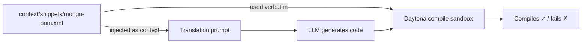

> **Prompt engineering** decides *what to ask* the model. **Context engineering** decides *what to put in front of it* so the answer is grounded in reality rather than the model's memory. UOM leans heavily on the second — it is the difference between "code that looks right" and "code that compiles and returns the same data."

If you have not yet read [Prompt Engineering](./prompt_engineering), skim it first: this page describes the **material** that the dynamic prompt builder injects.

---

## 1. What "Context Engineering" Means Here

A language model translating EF Core to Spring Data MongoDB *from memory* will, sooner or later:

- invent a package version that does not exist,
- pick an arbitrary collection/field name that does not match your database,
- emit a query that compiles but reads the wrong field,
- or wrap everything in boilerplate (drivers, config loaders, serializers) that drifts from what the sandbox actually expects.

Context engineering removes the guessing. Before the model writes anything, UOM gives it **three kinds of ground truth**, all sourced from real files rather than the model's training data:

1. **Framework configuration** — the exact `.csproj` / `pom.xml` (versions, dependencies, language level).
2. **Schema mappings** — the canonical relational→document / relational→graph mapping, including naming and embedding rules.
3. **Compilation skeletons** — full, verified harness programs the model only has to fill in.

All of this lives in [`services/orchestrator/src/context/`](/backend_code_reference/react_agent/index) and is injected **per translation pair** — only the active source and target are included, never all five frameworks (see [Token Efficiency](#4-key-benefits)).

---

## 2. Ground-Truth Schema Mappings

To avoid arbitrary naming and incorrect type mappings, the orchestrator references static JSON mapping definitions under `context/mappings/`:

- **`mappings/mssql_mongodb.json`** — maps relational MSSQL tables/columns onto MongoDB collections/fields, including embedding strategy.
- **`mappings/mssql_neo4j.json`** — maps relational MSSQL tables/columns onto Neo4j node labels, properties, and relationship directions.

These files are not hand-written prose — they are the **actual export from [MongoDB Relational Migrator](https://www.mongodb.com/docs/relational-migrator/)** (the same tool used in the [ETL step](/index) that populates the databases). That means the mapping the LLM reads is *byte-for-byte the mapping the data was migrated with* — there is no opportunity for the model and the database to disagree.

A representative excerpt (trimmed) of the real format:

```json
{
  "version": "1.8.0",
  "project": {
    "name": "UOM WideWorldImporters",
    "type": "SQL_SERVER",
    "content": {
      "settings": { "casing": "CAMEL_CASE", "keyHandling": "GENERATED" },
      "collections": {
        "5bd7402f-...": { "name": "orders" },
        "67c830a5-...": { "name": "orderLines" }
      },
      "mappings": {
        "84a19f24-...": {
          "settings": {
            "type": "EMBEDDED_DOCUMENT_ARRAY",
            "embeddedPath": "stockItemStockGroups",
            "foreignKeyName": "FK_Warehouse_StockItemStockGroups_StockItemID_..."
          },
          "fields": {
            "StockItemID": {
              "target": { "name": "stockItemId", "type": "INTEGER" },
              "source": { "name": "StockItemID", "databaseSpecificType": "int", "isPrimaryKey": false }
            }
          }
        }
      }
    }
  }
}
```

Two things this teaches the model that it could never reliably guess:

- **Exact casing rules** (`StockItemID` → `stockItemId`, `CAMEL_CASE`) so generated `@Field(...)` names match the documents on disk.
- **Embedding decisions** (`EMBEDDED_DOCUMENT_ARRAY`, `embeddedPath`) — i.e. that `StockItemStockGroups` rows are *embedded inside* their parent stock item rather than stored as a separate collection. This is the single hardest part of relational→document mapping, and it is provided as fact, not inferred.

<Note>
The mapping JSON is large. UOM injects it into the **schema-inspection** stage (where an LLM + MCP database tools distill it into a concise `schema_context` summary) rather than dumping the whole file into the translation prompt. See [MCP Integration](/developer_docs/backend/mcp_integration) and [State & Context](/developer_docs/backend/state_and_context).
</Note>

---

## 3. Compilation Skeleton Snippets

The second most common LLM failure is **incomplete boilerplate**: a missing import, a wrong namespace, an incompatible dependency version, or a half-written `main()`. UOM eliminates this by storing complete, *compilable* project and harness skeletons under `context/snippets/`.

| Snippet type | Files | What it pins down |
| :--- | :--- | :--- |
| **Project configs** | `efcore-sandbox.csproj`, `dapper-sandbox.csproj`, `nhibernate-sandbox.csproj`, `mongo-pom.xml`, `neo4j-pom.xml` | Exact SDK/runtime, NuGet/Maven dependencies and versions, language level. |
| **Schema entrypoints** | `EFCoreSchemaValidationEntrypoint.cs`, `MongoSchemaValidationEntrypoint.java`, … | A runnable program that loads the schema and fetches one entity per type to prove the mapping works. |
| **Query entrypoints** | `EFCoreQueryEntrypoint.cs`, `MongoQueryEntrypoint.java`, `Neo4jQueryEntrypoint.java`, … | A runnable harness that executes the query and serialises `count` / `firstSample` / `lastSample` as JSON. |

These are loaded by `get_framework_config_content()` (configs) and `get_snippet_content()` (entrypoints) and injected as **few-shot examples** into the translation prompt. The pinned versions are listed in [Design Decisions §2.4](./design_decisions#24-newest-framework-versions-pinned-exactly).

The key insight: the **same file** is used twice.



Because the model is shown the *exact* `pom.xml` that the sandbox will compile against, "the API the model wrote for" and "the API it is compiled against" are guaranteed identical. There is no version skew to hallucinate around.

---

## 4. Why the Context Lives in the Orchestrator's `context/` Folder

Keeping these resources as plain files inside `services/orchestrator/src/context/` (rather than, say, hard-coded strings or a database) is a deliberate design choice:

1. **Single source of truth, reused twice.** The same `.csproj`/`pom.xml` and harness skeletons are both *injected into the prompt* and *shipped into the compile sandbox*. One file, zero drift.
2. **Pair-scoped injection = token efficiency.** At runtime, only the active source and target files are read (`FRAMEWORK_TO_CONFIG_FILES` / `FRAMEWORK_TO_SNIPPET_FILES`). The prompt never carries context for the four frameworks you are not using.
3. **Editable without touching code.** Adding a framework or bumping a dependency version is a matter of dropping a file in `context/` and registering it in `constants.py` — no prompt rewrite. This is exactly the extension path described in the [Contribution Guide](/developer_docs/contribution).
4. **Versionable & reviewable.** Because they are real files in git, the ground-truth context is diffable and code-reviewable like any other source.

### Key benefits, summarised

1. **Minimises dependency errors** — pre-pinned NuGet/Maven dependencies leave nothing for the model to invent.
2. **Standardised serialization** — skeletons define exact ISO date and decimal (3 d.p.) formatting, so the [DeepDiff equivalence check](/developer_docs/backend/validators_and_equivalence) compares like-for-like data shapes.
3. **No boilerplate generation** — the model spends its tokens on the *translation*, not on regenerating drivers, config loaders, and test rigs, keeping its attention focused and the output faster and more accurate.

---

## 5. Related Reading

<CardGroup cols={2}>
  <Card title="Prompt Engineering" icon="wand-magic-sparkles" href="./prompt_engineering">
    How this context is assembled into the dynamic system prompt.
  </Card>
  <Card title="Design Decisions" icon="compass-drafting" href="./design_decisions">
    Why these frameworks, versions, and Template APIs were chosen.
  </Card>
  <Card title="Validators & Equivalence" icon="scale-balanced" href="/developer_docs/backend/validators_and_equivalence">
    How the skeletons are compiled and the results compared.
  </Card>
  <Card title="MCP Integration" icon="plug" href="/developer_docs/backend/mcp_integration">
    How the live schema is inspected and summarised into context.
  </Card>
</CardGroup>
