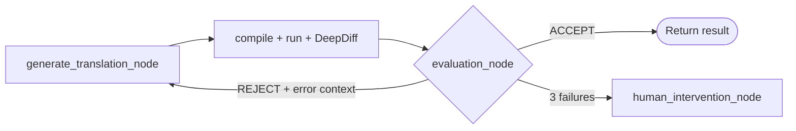

UOM achieves reliable translation between ORM, ODM, and OGM frameworks by **constructing every prompt dynamically for the exact translation pair requested** — never a static, one-size-fits-all template. Each prompt carries the precise persona, hard rules, ground-truth framework configuration, and verified few-shot examples needed for *that* source→target combination, and nothing else.

The core implementation lives in [`services/orchestrator/src/react_agent/prompts.py`](/backend_code_reference/react_agent/prompts).

<Note>
This page covers the **prompt** side. The data those prompts are filled with — `.csproj`/`pom.xml` configs, schema mappings, harness skeletons — is covered in [Context Engineering](./context_engineering). The two work together.
</Note>

---

## 1. One Prompt Per Pipeline Stage

UOM is a multi-stage [LangGraph](https://langchain-ai.github.io/langgraph/) pipeline, and **each stage has its own purpose-built system prompt** rather than one giant prompt doing everything. This keeps every model call focused and short except where length is unavoidable.

| Stage | Prompt | Job | Model (default) |
| :--- | :--- | :--- | :--- |
| Extraction | `SYSTEM_PROMPT_EXTRACTION` | Parse free-form chat into structured `{frameworks, versions, code, type}`. | `qwen3-coder-next`, temp 0 |
| Schema inspection | `SYSTEM_PROMPT_SCHEMA_INSPECTOR` | Use MCP DB tools to summarise the live schema. | `deepseek-v4-pro-thinking`, temp 0 |
| **Translation** | `build_system_prompt()` (assembled at runtime) | Generate the translation **and** runnable validation harnesses. | `kimi-k2.6`, temp 0 |
| Evaluation | inline judge prompt | Read validator + DeepDiff output, decide `ACCEPT`/`REJECT`. | `kimi-k2.6` |

The translation prompt is by far the largest and most important — and, as [§5](#5-why-it-takes-12-minutes) explains, the main reason a run takes minutes.

---

## 2. The Dynamic System Prompt Builder

The translation stage calls `build_system_prompt(state)`, which **assembles** the prompt at runtime instead of reading a fixed string:

```python
async def build_system_prompt(state: State) -> str:
    """Dynamically build the system prompt based on the specific translation pair."""
    assert state.source_target is not None and state.destination_target is not None
    base_prompt = f"""You are a Universal Object Mapping architect. Your goal is to aid in
translating database schema structures and query logic between diverse languages and frameworks.

Source Framework: {state.source_target.value}
Destination Framework: {state.destination_target.value}
...
--- Validation setup configuration ---
Source ({state.source_target.value})
{await get_framework_config_content(state.source_target)}
Target ({state.destination_target.value})
{await get_framework_config_content(state.destination_target)}
..."""
```

The prompt is built from four layers, in order:

1. **Persona + hard rules** — *"You are a Universal Object Mapping architect…"* plus the non-negotiable contract.
2. **Injected framework configs** — the literal `.csproj` and `pom.xml` for the source and target (`get_framework_config_content`).
3. **Curated few-shot examples** — hand-verified input→output pairs for the relevant paradigm.
4. **Validation-entrypoint snippets** — full, compilable harness skeletons for the source and target (`get_snippet_content`).

### 2.1 The "core translation contract"

The rules are written as an explicit, numbered contract so the model cannot drift. The most consequential ones:

```text
Core translation contract:
1. Identify whether the user input contains schema code, query code, or both.
2. Translate only what is requested by translation type.
3. Preserve behavior, field intent, and query semantics.
4. Keep translated query methods semantically equivalent to the source query method.
   Do not introduce synthetic validator parameters ... unless they already exist in source query code.
5. Keep schema code and query code separated.
...
9. DO NOT USE COMMENTS OR PLACEHOLDERS IN TRANSLATED CODE. THIS CODE WILL BE EXECUTED.

Framework rules:
1. For Java schema classes, avoid public access modifier unless explicitly required.
2. For Spring Data MongoDB queries, use MongoTemplate with Query/Criteria API.
3. For Spring Data Neo4j queries, use Neo4jTemplate and Cypher-DSL (Statement-based),
   not raw string concatenation.
4. Keep translated query method shape close to source query method shape.
```

Two of these rules carry most of the project's design philosophy:
- Rule **9** ("this code will be executed") reframes the task from "write plausible code" to "write code that survives a compiler and a live database" — see [Why You Can Trust the Translation](./design_decisions#7-why-you-can-trust-the-translation).
- The framework rules **hard-code the Template-API decision** ([Design Decisions §3](./design_decisions#3-template-apis-vs-repository-patterns)) directly into the model's instructions.

### 2.2 Why configs are injected verbatim

Rather than telling the model *"use a recent Spring Data MongoDB"*, UOM pastes the **actual project file** it will be compiled against:

| Benefit | Effect |
| :--- | :--- |
| **Syntax precision** | Generated code matches the pinned API surface (e.g. Spring Boot 4.0.3, .NET 10) exactly. |
| **No hallucinated packages** | The model sees the real dependency list, so it cannot invent versions. |
| **Token efficiency** | Only the *active* pair's configs are injected — not all five frameworks. |
| **Cross-framework isolation** | MongoDB rules never leak into a Neo4j prompt, keeping the model's attention focused. |

---

## 3. Structured Output: The Model Fills a Typed Form

The translation node does **not** ask for free text. It uses a strict Pydantic schema (`TranslationOutput`) so the model returns clearly separated fields:

- `translated_schema_code`, `translated_query_code` — the deliverables.
- `source_validation_*`, `target_validation_*` — runnable harnesses + their declared entry-point class names.

Crucially, the schema is **trimmed per request**. `_create_translation_output_model(state)` uses Pydantic's `create_model` to *exclude* fields that aren't needed for the chosen `translation_type`:

```python
# If the user only wants to translate the schema, we strip out query-related fields.
# This prevents the LLM from hallucinating queries or harnesses it doesn't need to write, saving tokens.
if state.translation_type == TranslationType.SCHEMA:
    output_schema_overrides = { "translated_query_code": { ... "exclude": True }, ... }
```

So a *schema-only* request never even shows the model the query fields. Less surface area → fewer hallucinations → fewer tokens.

A second guard runs *after* generation: a Pydantic `model_validator` checks that each declared entry-point class name actually appears in the generated harness code, rejecting structurally broken output before it ever reaches a sandbox.

---

## 4. Temperature 0 and Self-Repair Across Turns

### 4.1 Why temperature 0

Every generation and evaluation model runs at **`temperature=0`**. For creative writing you want variety; for code translation you want the opposite:

- **Determinism / reproducibility** — the same input produces the same translation, which is essential for a research project running evaluation experiments and for debugging.
- **Fewer "creative" deviations** — at higher temperatures the model is more likely to invent an alternative API or restructure a query. Here, the *closest faithful* translation is always the right one.
- **Stable retries** — when the loop feeds an error back (below), temperature 0 means the model changes its output *because of the feedback*, not because of random sampling noise.

### 4.2 How the model repairs its own mistakes

The first attempt is not always correct — a query may compile but return slightly different data, or fail to compile. UOM is designed so the model **fixes itself on the next turn** instead of starting from scratch.

When validation or evaluation fails, the graph loops back to `generate_translation_node`, and it re-invokes the model on the accumulated `translation_messages` rather than the original prompt:

```python
response = await agent.ainvoke({
    "messages": [*state.translation_messages]
        if len(state.translation_messages) > 0
        else [HumanMessage(content=message)]
})
```

That `translation_messages` thread now contains the **concrete failure evidence**: the compiler `stderr`, or the DeepDiff payload showing exactly which field/count differed, or the judge's rejection reason. So on turn 2 the model is no longer guessing — it is reading *"`javac error: cannot find symbol OrderItem`"* or *"`values_changed: root['unitPrice'] 48.5 → 48.0`"* and correcting that specific defect.



This converts the LLM from a one-shot generator into a **closed-loop, self-correcting** one. The retry budget is capped (`MAX_TRANSLATION_LOOPS = 3`); after that the run pauses for a human rather than looping forever. The isolated `translation_messages` thread (separate from the user-facing `messages`) keeps all this noisy debug back-and-forth out of the main conversation — see [State & Context](/developer_docs/backend/state_and_context).

---

## 5. Why It Takes ~12 Minutes

A full translation run typically takes around **12 minutes**. That feels slow next to a normal chat completion, and the reasons are worth understanding because they are mostly *deliberate trade-offs in favour of correctness*.

### 5.1 `generate_translation` is the slowest stage — because its prompt is the largest

The translation node's prompt is, by a wide margin, the biggest in the pipeline. It contains:

- the full persona + multi-section rule contract,
- **two injected project files** (source `.csproj` + target `pom.xml`),
- **four to five few-shot examples** of complete schema/query translations,
- **two full validation-entrypoint skeletons** (source and target), which are long, real programs.

On the *output* side, the model must produce a large structured object — not just the query, but **multiple fully-runnable harness programs** (schema setup, query harness, JSON serialisation, entry points) for both source and target. Generating thousands of tokens of correct, compilable code is inherently slow, and the default models (`kimi-k2.6`, with thinking-capable fallbacks like `deepseek-v4-pro-thinking`) are large reasoning models chosen for *accuracy over speed*.

### 5.2 The other time sinks

| Stage | Why it costs time |
| :--- | :--- |
| **Sandbox compilation** | Each [Daytona](https://www.daytona.io/docs/) sandbox is a clean container. `mvn` downloads Spring Boot dependencies and `dotnet` restores NuGet packages **on every run** — this alone is a couple of minutes. (Pre-baking these caches is the #1 [roadmap](/roadmap) item, targeting sub-10-second builds.) |
| **Live query execution** | Both the source and target harnesses actually run against real databases and serialise results. |
| **Retry loops** | If the first translation is rejected, the whole generate→compile→run→judge cycle repeats (up to 3×), multiplying the cost. |
| **Multiple model calls** | Extraction, schema inspection, translation, and the independent judge are separate LLM calls. |

In short: **the latency buys you the correctness guarantees.** UOM is not optimised to answer fast; it is optimised to only ever return a translation that *compiled with the real toolchain and produced equivalent data against a real database*. Most of the 12 minutes is spent **proving** the answer, not guessing it.

---

## 6. Related Reading

<CardGroup cols={2}>
  <Card title="Context Engineering" icon="layer-group" href="./context_engineering">
    What fills these prompts: configs, mappings, and harness skeletons.
  </Card>
  <Card title="Design Decisions" icon="compass-drafting" href="./design_decisions">
    Why Template APIs, these frameworks, and why you can trust the output.
  </Card>
  <Card title="Architecture & LangGraph" icon="diagram-project" href="/developer_docs/backend/architecture">
    The full state machine these prompts run inside.
  </Card>
  <Card title="prompts.py Reference" icon="file-code" href="/backend_code_reference/react_agent/prompts">
    The annotated source for every prompt described here.
  </Card>
</CardGroup>
